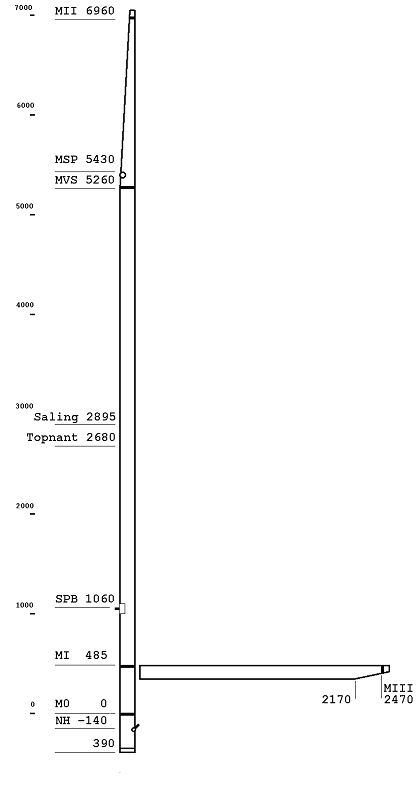
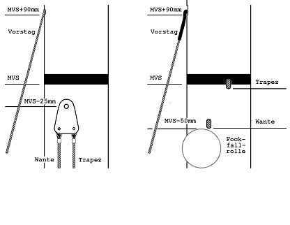
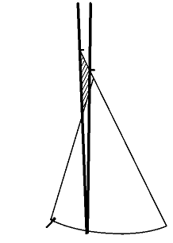
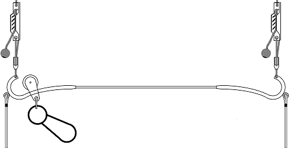
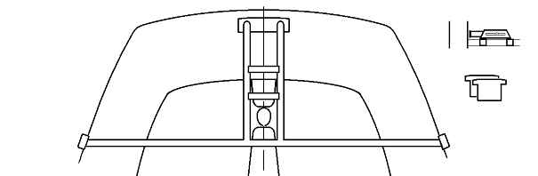
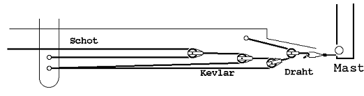
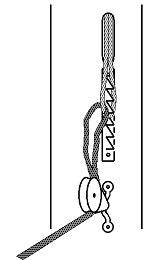
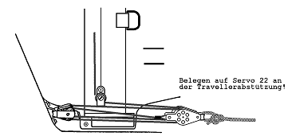
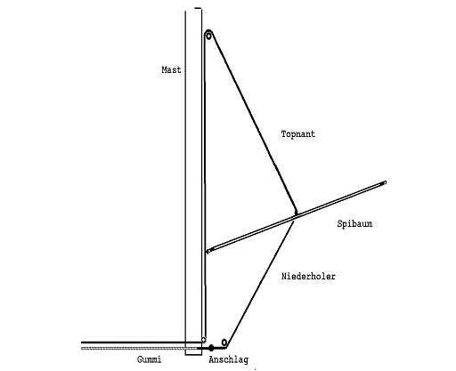

Das JETON-Rigg hat im Laufe der Zeit (1970-1974) mehrere Änderungen der Vermessung erfahren. Seither sind die Maße unverändert. Seit 1992 sind verjüngte Masten erlaubt. Die erlaubte Dicke des Baumes wurde 1986 vergrößert. Seit 1992 darf der Baum am Ende abgeschrägt sein.
In diesem Kapitel wird das Rigg in der aktuellen Vermessung beschrieben.

## Inhalt
- [Übersicht](#Übersicht)
- [Mast](#mast)
  * [Mastprofile](#mastprofile)
  * [Verjüngt oder unverjüngt](#verjüngt-oder-unverjüngt)
  * [Mastlänge](#mastlange)
  * [Mastvermessung](#mastvermessung)
  * [Die Meßmarke MVS](#die-meßmarke-mvs)
  * [Vorstag](#vorstag)
  * [Saling](#saling)
  * [Lümmel](#lümmel)
- [Großbaum](#großbaum)
- [Spinnakerbaum](#spinnakerbaum)
  * [Profile](#profile)
  * [Endbeschläge](#endbeschläge)
- [Klassenvorschrift](#klassenvorschrift)
- [Maße des stehendes Gutes](#maße-des-stehendes-gutes)
- [Trapeze](#trapeze)
  * [Allgemeines](#allgemeines)
  * [Länge](#länge)
  * [Beidseitiges Trapez](#beidseitiges-trapez)
  * [Endlostrapez](#endlostrapez)
- [Mastcontroller](#mastcontroller)
- [Innenlaufende Fallen](#innenlaufende-fallen)
- [Fockfall / Riggspannung](#fockfall---riggspannung)
- [Großfall](#großfall)
- [Spifallsysteme](#spifallsysteme)
  * [Übersicht](#Übersicht-1)
  * [Spifalltalje](#spifalltalje)
- [Topnant/Niederholer](#topnant-niederholer)
- [Beschläge für Trimmschoten](#beschl-ge-für-trimmschoten)
- [Segel](#segel)
  * [Allgemeines](#allgemeines-1)
  * [Fockvermessung](#fockvermessung)
  * [Großsegelvermessung](#großsegelvermessung)
  * [Halsbändsel](#halsbändsel)

## Mast
### Mastprofile
Ganz alte JETONs waren mit sehr dünnen Masten von Hahn ausgerüstet. Die dazugehörigen Segel hatten zwei durchgehende Latten. Wie die Vermessung des Mastes war, ist mir nicht bekannt. Dieser Mast war sehr flexibel, aber für den JETON etwas zu schwach.

Boote mit den Nummern ca. 200-800 waren mit dem einem Mast mit einem etwas steiferen Mast mit fast rundem tropfenförmigen Profil von Ermat ausgerüstet. Dieser "alte Ermat-Mast" hatte die richtige Flexibilität.
Er wurde dann durch den "neuen Ermat-Mast" ersetzt, der für den JETON eigentlich zu hart war.

Als Ermat pleite machte, hat Klepper sich ein sehr ähnliches Profil anfertigen lassen. Dieser als "Klepper-Mast" bekannte Mast hatte dieselben Eigenschaften wie der "neue Ermat-Mast". Kein "Klepper-Mast" ist ganz gerade. Auch die Grubenboote waren bisher mit Klepper-Masten ausgerüstet. Hans Spannheimer war der erste der sein Boot mit einem Proctor-Mast ausgerüstet hat. Er hat sich für das D-Profil entschieden, das in der unverjüngten Form auch das Optimum darstellt. Bei hartem Wetter wünscht man sich manchmal eher einen etwas stabileren Mast.
Als Optimum für den verjüngten Mast hat sich der Proctor-Epsilon oder der M2 von Superspars erwiesen. Beide sollen die gleiche Biegekurve haben.

### Verjüngt oder unverjüngt
Die Verjüngung des Mastes erzeugt eine gleichmäßige Mastbiegekurve bis zum Top. Dies ist zunächst ein aerodynamischer Vorteil. Andererseits federt der flexiblere Top in Böen nach Lee und öffnet im oberen Teil das Großsegel. Das nimmt den Druck aus dem Großsegel, der Steuermann muß nicht so stark fieren, der Vorschoter muß nicht so viel 'raus und 'rein. Im unteren Bereich kann das Segel voll stehen bleiben und leistet weiterhin vollen Vortrieb. Der verjüngte Mast macht das Boot also bequemer, sicherer und schneller.

### Mastlänge
Alle neuen Ermat- und Klepper-Masten sind ca. 3 cm kürzer als sie sein sollten. Die Meßmarke M0 liegt daher um diesen Betrag unter der Deckshöhe. Die Klassenvorschrift wurde, da dies sehr viele Boote betraf, in Rücksicht darauf geändert (->Regel 12.3). Neu angefertigte Masten sollten auf jeden Fall in der richtigen Länge angefertigt werden. Der Baum kommt etwas höher, das ist gut für den Schotten, und oben ist mehr Wind.

### Mastvermessung
Die Mastvermessung ist in der Abb. 4-1 angegeben. Es sei darauf hingewiesen, daß folgende Maße durch die Klassenvorschrift nicht festgelegt sind:
* Anschlagpunkt des Vorstages
* Höhe der Saling über M0
* Umlenkung/Austritt des Topnanten am Mast
* Höhe des Spibaumauges über M0

**Achtung:** An den Ermat- und Klepper-Masten ist der Beschlag zum Anbringen der Wanten, Trapeze und des Vorstages ist mit einer Schraube befestigt. Die optimale Position dieser Schraube ist 25 mm unterhalb der Meßmarke MVS (Abb. 4-2a). In der Abbildung ist der Vorstag nicht, wie beim Originalmast am Vorstaghänger befestigt, sondern einfach

**Abb. 4-1 Mastvermessung**

durch ein kleines Langloch in den Mast geführt und innen mit einer Pressung fixiert. Diese Lösung eignet sich besonders für die alten Vorstaghänger, wenn eine Rollfock gefahren werden soll, da bei diesen Fockvorliek und Vorstag sehr dicht beieinander liegen. Entschließt man sich das Fockfall im Mast zu führen, kann man auf den Vorstaghänger ganz verzichten. Bei Masten mit T-Terminals sollten die Langlöcher für die Wanten so angebracht sein, daß der Angriffspunkt 50 mm unter der Meßmarke MVS liegt. Die Trapezdrähte sollten direkt an der Marke angreifen (Abb. 4-2b).

**Abb. 4-2Anschlag Vorstag, Wanten und  Trapezdrähte, a. Wantenhänger, b. mit Terminals**

### Die Meßmarke MVS
Bei älteren Booten ist die Meßmarke MVS, d.h. der Punkt am Mast, wo Vorstag, Wanten, Fockfallrolle und Trapezdrähte angeschlagen sind, 100-200 mm tiefer als sie nach der jetzt gültigen Klassenvorschrift sein darf. Maße, die zur Meßmarke MVS passen müssen, (MSP, Salinghöhe, Spibaumauge) sind dadurch ebenfalls zu tief. Mit der Einführung des Klepper-Mastes die Marke MVS auf 5260 mm über M0, d.h. 1700 mm unter MII (am Masttop) gesetzt und die Klassenvorschrift entsprechend geändert.
Dieses neue Maß ist am Wind erheblich günstiger.

**Abb. 4-3 Effekt der versetzten Meßmake MVS**

Warum?

Der Hauptfaktor ist, daß im oberen Bereich die Düse zwischen Groß- und Vorsegel geöffnet wird, wie in Abb. 4-3 zu sehen ist. Gleichzeitig wird, wenn das Fockschothorn an der gleichen Stelle bleiben soll, der Mastfall vergrößert. Dies ist nach den Erfahrungen der letzten Jahre ebenfalls günstig. Versuchte man, die Düse allein durch mehr Mastfall zu öffnen, käme das Schothorn zu tief und man hätte nicht genug Zug auf dem Achterliek. Bemerkenswert ist auch, daß bei der alten Position der Marke MVS der Abstand zwischen Umlenkrolle am Mast und Vorstagkamm so klein ist, daß ein Durchsetzen des Liekdrahtes nicht im ausreichenden Maße möglich ist, besonders, wenn der Fockroller gefahren wird.

Der Unterschied ist auffällig. Diese Maßnahme hat sich unbedingt bewährt. Alle - oder fast alle - Regattaschiffe wurden umgerüstet.

Bauanleitung in [Kapitel 6](6-UMBAUMASSNAMEN-BASTELANLEITUNGEN).

### Vorstag
Mit "Vorstag (total)" in Tab. 4-1, 4-2 ist die Länge gemeint, die bei richtig eingestellter Wantenlänge, bei gerade entspanntem Rigg, notwendig ist, um das Vorstag mit einem Schäkel am Vorstagkamm festzumachen. Um zu verhindern, daß das Vorstag bei gesetzter Fock herumbaumelt, gibt es drei Möglichkeiten.
* Das Vorstag wird um die Länge eines Wantenlocheisens verkürzt und mit dessen Hilfe am Vorstagkamm angebracht. Mit einem Gummistropp wird das Wantenlocheisen zum Stevengriff hin gespannt.
* Man benutzt ein Vorstag in voller Länge und bindet es mit einem Gummistropp zum Stevengriff hin.
* Man verkürzt das Vorstag um ca. 30 cm, und ersetzt das fehlende Stück durch ein Stück Kevlar. Parallel zu dem Kevlarstropp wird ein Gummistropp (6 mm) gespannt.

### Saling
Die Höhe der Saling über M0 und Salinglänge ist durch Klassenvorschrift nicht festgelegt und variiert bei älteren Booten, auch weil die Höhe der Meßmarke MVS variiert. Beim Klepper-Mast (der Gruben-Mast ist gleich) liegt die Saling 2680 mm über M0 und hat eine Länge von 450 mm. Dies hat sich bewährt.

**Achtung:** Einige Salinge, die von Klepper geliefert wurden sind nur 400 mm lang und müssen unbedingt ersetzt werden.

Die Pfeilung der Saling, auch Salingwinkel genannt beeinflußt die Mastkurve und damit das Großsegelprofil im mittleren Bereich (vgl. Kapitel , 7, Abschnitt Mastkurve). Die Salingwinkel sind im Allgemeinen mit zwei Schrauben oder Bolzen fest eingestellt. Wenn dieser Winkel gerade zum Großsegel paßt ist die ein glücklicher Zufall. Es gibt aber auch Salingversteller mit denen man den Salingwinkel einstellen kann. Eine einfache Möglichkeit ohne Salingversteller ist in Kapitel 6 beschrieben.

### Lümmel
Ermat- und Klepper-Masten haben spezielle Lümmelbeschläge, die nur zu den dazugehörigen Bäumen passen. Die Lümmelbeschläge der Proctor- und Superspars-Masten sind gleich. Man kann also ohne weiteres einen Proctor-Baum an einem Superspars-Mast fahren und umgekehrt.

Soll ein Proctor oder Superspars-Baum an einem Klepper- oder Ermat-Mast gefahren werden, braucht man einen neuen passenden Lümmelbeschlag. Dieser ist leicht anzubringen. Soll andersherum ein Klepper- oder Ermat-Baum an einem Proctor oder Superspars-Mast gefahren werden, muß der Stirnbeschlag des Baumes angepaßt werden.

Die Lümmelbeschläge sollten fest am Mast angebracht sein, z. B. mit Popnieten. unterhalb der Meßmarke MI darf man den Baum nicht fahren, oberhalb wird die Segelfläche unnötig verkleinert. Großsegel sind heute normalerweise so geschnitten, daß das Vorliek entlastet ist, wenn der Baum an der Meßmarke MI steht.

## Großbaum
Die JETONs von Klepper sind mit Bäumen von Ermat oder von Klepper ausgerüstet. Diese Bäume sind recht dünn. Während der Klepperbaum die notwendige Stabilität gerade aufbringt, ist der Ermat-Baum eigentlich unterdimensioniert. Dies gilt vor allem, wenn man ein Drahtdreieck und einen entsprechend dimensionierten Baumniederholer fahren will.

Für Neuanschaffungen sind in jedem Falle Bäume von Superspars oder Proctor zu empfehlen. Diese sind im Querschnitt größer und dadurch stabiler. Sie sind nur unwesentlich teurer.

## Spinnakerbaum
### Profile
Die von Klepper oder Gruben gelieferten Spinnakerbäume sind aus unverjüngtem Rohr mit 30 mm Ø. Besser sind Spinnakerbäume, die in der Mitte dicker und an den Enden verjüngt sind. Einen guten Spinnakerbaum kann man mit einem Rohling, der im Handel erhältlich selber bauen.

### Endbeschläge
Es gibt sehr viele verschiedene Endbeschläge für Spinnakerbäume. Mir gefallen am besten die Beschläge die unter dem Namen "Zalonghi-Beschläge" bekannt sind und vertrieben werden.

## Klassenvorschrift
Riggs mit der nicht versetzten Marke MVS oder auch mit einem Diamond sind von der Klassenvorschrift her erlaubt. Das "alte" JETON-Rigg (vor 1972 bis Segelnr. ca. 200) mit zwei durchgehenden Latten im Großsegel ist hingegen nicht mehr zulässig.

## Maße des stehendes Gutes
Die Maße für den Klepper-Mast sind in Tabelle 4-1 angegeben. Die angegebenen Werte gelten für den normalen Klepper-Mast, d. h. mit der reduzierten Länge (siehe Abschnitt "Mastlänge"), sonst in der Auslegung wie in Abb. 4-1 und Abb. 4-2 angegeben. Für die Ermat-Masten gelten die Maße, wenn die Marke MVS hochgesetzt wurde (siehe Abschnitt "Die Marke MVS"). Voraussetzung ist eine Salinglänge von 450 mm. Hat man einen Mast in voller Länge zur Verfügung sind die Längen von Wanten und Vorstag entsprechend zu ändern.

Tab. 4-2 gibt die Maße für Stehendes Gut mit T-Terminals an (Proctor oder Superspars). Abb. 4-2 b. zeigt die Ansatzpunkte von Wanten, Vorstag und Trapezen. Die Maße gelten nur bei dieser Auslegung des Mastes und maximaler Länge bei der angegebene Salinglänge von 450 mm. Es sei darauf hingewiesen, daß es sehr schwierig ist diese Maße allgemeingültig anzugeben. Alle möglichen Konfigurationen können kaum berücksichtigt werden. Die Angaben sind daher ohne Gewähr.
Besonders schwierig ist die Angabe einer Länge für das Fockfall, da es verschiedene Auslegungen des Fockfallstreckers gibt. Die "freie Länge Fockfall" ist der Abstand des Bolzens im Schäkel oder im Gabelterminal des Fockfall von der Meßmarke MVS bei gesetzter Fock und nicht angezogener Riggspannung.

Tab. 4-1 Maße für Mast mit Wanten/Trapez/Vorstaghänger

| Beschreibung                  | Maß     |
| ----------------------------- | ------- |
| Wanten                        | 5100 mm |
| Vorstag (total)               | 5500 mm |
| Vorstag (netto)               | 5210 mm |
| Vorstag(total nach Abb. 4-2a) | 5690 mm |
| Trapezdraht (Einfachtrapez)   | 4720 mm |
| Trapezdraht (Endlostrapez)    | 4520 mm |
| Fock-Vorliekdraht             | 4960 mm |
| Freie Länge Fockfall          | 490 mm  |
| Salinglänge                   | 450 mm  |

Tab. 4-2 Maße für Masten mit T-Terminals.

| Beschreibung                | Maß     |
| --------------------------- | ------- |
| Wanten                      | 5170 mm |
| Vorstag (total)             | 5690 mm |
| Vorstag (netto)             | 5400 mm |
| Trapezdraht (Einfachtrapez) | 4720 mm |
| Trapezdraht (Endlostrapez)  | 4570 mm |
| Fock-Vorliekdraht           | 4960 mm |
| Freie Länge Fockfall        | 490 mm  |
| Salinglänge                 | 450 mm  |

## Trapeze
### Allgemeines
Die Klepper und Gruben-JETONs sind serienmäßig meistens mit beidseitigen Trapezen ausgestattet. Einige Klepper-JETONs heben ein Endlostrapez.

### Länge
Die Länge des Trapezes sollte so bemessen sein, daß die tiefste Position des Trapezhakens etwa auf der Scheuerleiste liegt. Selten, gerade bei böigem Wind, wird man so tief hängen. Doch sollte es im Prinzip möglich sein. Außerdem sollte der Vorschoter bei durchgekentertem Boot neben dem Boot auftauchen können, auch wenn er sich in der Aufregung nicht ausgeklinkt hat.

### Beidseitiges Trapez
Beim beidseitigen Trapez braucht man zwei Taljen, die es erlauben, die Höhe des Trapezhaken einzustellen, und je einen Haken für beide Seiten. Vor Wende oder Halse muß sich der Vorschoter ausklinken und sich auf der neuen Seite wieder einklinken.

### Endlostrapez
Beim Endlostrapez hängt sich der Vorschoter an einem Trapezhaken oder -ring ein. Dieser ist an einer Rolle befestigt, die über einen Gummi, der von einem Trapez zum anderen Laufen kann. Am Trapez geht der Gummi in einen Bügel über auf dem die Rolle dann hängt (Abb. 4-4). Der Vorschoter braucht sich nie auszuklinken.
Die von Klepper benutzten Bügel der Endlostrapeze waren völlig ungeeignet. Die meisten Segler haben mit der Bemerkung "Mit einem Endlostrapez bin ich nicht klargekommen." beidseitige Trapeze angebracht. Sie haben leider nie erfahren, wie praktisch ein Endlostrapez ist, wenn es funktioniert. Einige Dinge muß man dazu beachten:
* Die Bügel des Endlostrapezes sollte etwa aussehen wie in Abb. 4-4. Wichtig ist, daß die Rolle nicht vom Bügel hinunterläuft, wenn das Trapez nicht belastet ist. Dazu muß der Bügel wie in der Abb. angegeben gebogen sein. Wichtig ist auch die Lage der Öse, die für die waagerechte Lage des Bügels sorgt.
* Das Gummi sollte möglichst glatt in den Bügel übergehen, d. h. man sollte ein möglichst dickes Gummistropp verwenden.
* Die Talje zum Verstellen des Trapezes sollte über dem Bügel angebracht sein. Sonst kommt der Bügel mitunter zu hoch, und die Rolle kann in der Wende unter dem Großbaum hängen bleiben.
Von der Firma FICO (...) gibt es ein sehr schönes Endlostrapez. Statt des Originalgummis sollte man jedoch ein Gummi mit 6 mm Ø einziehen.

**Abb. 4-4 Endlostrapez**

## Mastcontroller
Alle neueren Schiffe sind mit einer seitlichen Mastführung, Mastcontroller genannt ausgerüstet. Dieses System hat sich bewährt und hat den früher üblichen Diamond verdrängt.

Der von Klepper und Gruben serienmäßig eingebaute Mastcontroller ist aus Niro-Rohr. Er wird am schrägen Querschott angeschraubt. Nachteil dieser Konstruktion ist, daß der Mastcontroller dem seitlichen Mastdruck etwas nachgibt. Auf das Querschott werden sehr starke Kräfte ausgeübt. Bei einigen Booten hat der Mastcontroller das Querschott sogar eingedrückt. Dagegen hilft nur eine Verstärkung des Querschotts oder eine Abstützung des Mastcontrollers nach den Seiten hin (Bauanleitung in [Kapitel 6](6-UMBAUMASSNAMEN-BASTELANLEITUNGEN)).

Hans Spannheimer hat als Erster einen sehr guten Mastcontroller mit Abstützung auf das Seitendeck gebaut. Seine Konstruktion ist sicher als die optimale Lösung für den JETON anzusehen. Leider ist sie für die Serienfertigung zu aufwendig. Eine einfachere Konstruktion ist in Abb. 4-5 angegeben. Dieser Mastcontroller ist in den Booten der Berliner Serie und denen von Robert Franz serienmäßig eingebaut. Zur seitlichen Führung werden Leisten auf beiden Seiten des Mastes in den Mastcontroller gelegt. Der Mast sollte mit einer Mastmanschette versehen sein.
Die Vor-/achterliche Biegung des Mastes sollte nach vorne begrenzt werden. Dies kann entweder durch Keile geschehen, die in den Mastcontroller zwischen Mast und die davorliegende Querstrebe gesteckt werden, oder durch einen Mastandrücker, der auf den Querstreben des Mastcontroller montiert wird (Abb. 4-5).

**Abb. 4-5 Mastcontroller, Keile, Mastandrücker**

## Innenlaufende Fallen
Alle Masten von Ermat, Klepper und Gruben haben außenlaufende Fallen. Die Markenmasten von Superspars und Proctor sind nur mit innenlaufenden Fallen zu haben.

Innenlaufende Fallen haben den Vorteil, daß an den herunterlaufenden Fallen sich nichts verhaken kann. Alles ist ordentlicher und aufgeräumter. Ein Nachteil ist natürlich, daß die Fallen schwerer einzuziehen sind und, daß sie sich, wenn man es ungeschickt macht, im Mast vertörnen können.

Es gibt jedoch ein wichtiges Argument für ein innenlaufendes Fockfall: Die Riggspannung übt auf den Mast einen nicht unerheblichen Stauchdruck aus. Das Fockfall läuft an der Mastvorderkante herunter. Ich habe schon oft beobachtet, daß der Mast dem Stauchdruck seitlich ausweicht und nach der Seite wegrutscht. Das Fockfall bleibt dabei senkrecht, rutscht also nach der anderen Seite. Damit hat der Mast eine permanente seitliche Biegung von ca. 50-100 mm in der Mitte. Damit ist natürlich jeder Trimm zum Teufel. Dies passiert um so leichter je mehr Mastbiegung gefahren wird. Ein innenlaufendes Fockfall kann nicht wegrutschen; der Mast bleibt gerade.

## Fockfall / Riggspannung
Die Riggspannung, die Spannung auf den Wanten und dem Fockfall/Liektau wird beim JETON über die Spannung des Fockfalls eingestellt. Einstellung über die Wanten, was vom Trimm her besser wäre, ist durch Klassenvorschrift nicht erlaubt, und außerdem technisch erheblich aufwendiger.

Die Riggspannung sollte der Windstärke entsprechend eingestellt werden. Sie darf während des Segelns getrimmt werden. Dazu haben neuere Boote einen Bierkasten, der an der Vorderseite des Mastes montiert ist. Die Bierkastenschot ist vom Cockpit aus zu bedienen. Ältere Boote haben nur eine Lochschiene mit Spannhaken, so daß die Riggspannung während des Segelns nicht verstellt werden kann. Bei mehreren Booten hat sich eine am Schwertkasten frei laufende Talje bewährt (Abb. 4-6, Zur Befestigung der Enden werden Knöpfe benutzt, [Kapitel 6](6-UMBAUMASSNAMEN-BASTELANLEITUNGEN)).

**Abb. 4-6 Talie für die Riggspannung**

Keins der angegebenen Systeme läßt eine Einstellung der Riggspannung von ganz lose bis auf den Maximalwert zu. Die Länge des Fockfalls ist also so zu bemessen, daß das Rigg beim Einhängen schon eine gewisse Vorspannung erhält. Ohne Spannung auf den Wanten sollten noch ca. 7 cm fehlen, um das Fockfall auf den Haken zu bringen.

## Großfall
Die meisten JETON-Masten haben einen Schlüssellochbeschlag am Masttop in den das Großfall mit Hilfe einer Kugelpressung eingehängt werden kann. Dies ist sehr elegant, da man kein Reck im Großfall hat. Leider ist das System nicht ganz einfach zu bedienen, vor allem beim Ermat-Mast. Der Beschlag am Klepper-Mast funktioniert erheblich besser.

Dieses System kann bei innenlaufendem Großfall natürlich nicht benutzt werden. Hier eignet sich die Belegung auf einer Hakenschiene am Mast unten (Abb. 4-7).

**Abb. 4-7 Hakenschiene für Großfall**

## Spifallsysteme

### Übersicht
JETONs von Klepper oder Gruben haben serienmäßig keine Beschläge, die eine vernünftige Spifallführung erlauben. Wenigstens ist eine Rolle in der Nähe des Mastfußes anzubringen, die das Spifall nach hinten umlenkt. Besser ist ein im Mast laufendes Spifall, wie es bei den Superspars- und Proctor-Masten standardmäßig eingebaut ist. Das Fall tritt dabei über eine Rolle im Mastfuß oder ein seitliches Langloch am Mast aus. Die Ermat- oder Klepper-Masten können relativ leicht umgebaut werden (Kapitel 6).

Das Spifall kann dann an einer der Klemmen an der Travellerabstützung belegt werden. Dabei ergeben sich zwei Probleme: Um den Spinnaker zu hissen, muß 6 m Fall mit der Hand durchgezogen werden. Das hochgezogene Fall liegt dann im hinteren Cockpit herum und verschwindet schlimmstenfalls durch die Lenzer nach draußen. Das Durchziehen kann mit einer Spifallpumpe vereinfacht werden. Zum Aufwickeln des Falls gibt es mehrere, teilweise aufwendige, Systeme. Beide Probleme lassen sich gleichzeitig durch die Spifalltalje lösen.

### Spifalltalje
Die Spifalltalje ist eine Einrichtung, die einerseits dafür sorgt, daß das Spifall ordentlich aufgeschossen ist, wenn der Spi oben ist und andererseits ermöglicht, den Spi extrem schnell zu hissen. Das System hat sich auf vielen Booten bestens bewährt. Damit es auch reibungslos funktioniert, müssen einige Kleinigkeiten berücksichtigt werden.

**Abb. 4-8 Die Spifalltalje**

Funktion: Das Spifall wird mit einer Rolle am Mast nach hinten umgelenkt und läuft dann in die Talje (Abb. 4-8). Die eine Rolle der Talje ist mit einer Fenderöse am schrägen Querschott befestigt, die andere (mit Hundsfott) ist an einem Holetampen befestigt, der auf einer Curryklemme an der Travellerabstützung zu belegen ist. Das Ende des Spifalls wird am Hundsfott angeknotet. Es handelt sich um eine umgekehrte Talje. Um den Spi zu hissen, braucht man also die fünffache Kraft, aber nur ein Fünftel des Weges. Zieht man am Holetampen, kann man mit einem Griff den Spi am Mast hochschießen lassen. Dies geht auch leicht genug, denn so schnell ist kein Druck im Spi.

**Hinweise:**
Das System funktioniert natürlich am besten mit kugelgelagerten Rollen. Es geht jedoch auch mit nicht kugelgelagerten. Wichtig ist, daß ein geeignetes Spifall verwendet wird. Das Spifall sollte aus 4 mm geflochtenen vorgerecktem Material sein. Hochzugfeste Materialien eignen sich mitunter hier nicht, da sie sich nicht leicht verdrillen. Gute Erfahrungen habe ich allerdings mit Dyneema gemacht, obwohl auch dieses Material sich nicht so gut verdreht. Die Doppelrollen der sollten Seiten aus Metall haben, da sonst die Seiten durch den schnellen Durchlauf des Falls durchgescheuert werden.

Wenn der Spi geborgen wird, sollte man etwas gegenhalten, daß die Talje sich nicht verheddert. Dies kann man jedoch auch mit einem Gummizug erreichen, der über eine Rolle am Spiegel wieder nach vorne geführt wird, und die Talje straff hält.

## Topnant/Niederholer
Von Susanne Bräss
Das von Klepper und Gruben serienmäßig angebotene Topnant/Niederholersystem wird heute auf keiner enstzunehmenden Regattajolle mehr gefahren, da es nicht nur umständlich sondern auch unsinnig ist. Es wird den Erfordernissen des Spisegelns in keiner Form gerecht. Die Forderungen nach einem gut funktionierenden Topnanten sind folgende:
* Korrektes in einer eingestellten Höhe Halten des Spibaumes. Er darf ein Absacken des Baumes nicht möglich machen, da dabei die Lieken des Spis zumachen.
* In der Bö sollte der Spi die Möglichkeit haben überschüssige Kraft abzulassen, dies erreicht man, indem der Baum bis zu einem Anschlag hin elastisch steigen kann. Ein heute auf Regattabooten übliches Topnantsystem ist in Abb. 4-9 dargestellt.

**Abb. 4-9 Topnant/Niederholersystem**

Der Topnant läuft über eine Rolle etwa in Salinghöhe am Mast hinunter, wird am Mastfuß umgelenkt und wird irgendwie belegt. Er dient zum Verstellen des Systems. Der Niederholer wird in der Nähe des Mastfußes nach hinten umgelenkt und geht in einen Gummistropp über, der irgendwo, z. B. an der Travelleabstützung oder am Schwertkasten. B. mit Hilfe eine Knopfes (Kapitel 6) festgelegt wird. Wo Niederholer und Gummistropp zusammengeknotet sind, wird ein Anschlag (Kugel) angebracht, der so eingestellt wird, daß der Baum ca. 10 cm höher steigen kann, als die üblicherweise höchste gefahrene Position.

Topnant und Niederholer sollten aus Kevlar, Dyneema oder (geflochtenem) Draht bestehen, damit kein allzu großer Reck im System ist.

Empfehlenswert ist es, den Topnant ebenso wie das Spifall im Mast zu fahren. Die Einlaßrollen für den Topnanten können genauso wie für das Spifall ausgelegt werden (siehe Abschnitt "Innenlaufende Fallen" und Kapitel 6).

Unterschiede gibt es bei der Belegung des Topnanten. Es werden drei Systeme benutzt:
* Am Reitbalken bzw. der Travellerabstützung mittschiffs. Dies ist technisch die einfachste Methode. Der Topnant wird einfach nach hinten umgelenkt und auf einer Klemme am Reitbalken belegt.
* Am Reitbalken bzw. am Traveller außen. Dann ist natürlich eine Verdopplerrolle notwendig (Kapitel 5). Hier muß am Ende des Topnant eine Rolle angebracht werden, durch die eine Schot gezogen wird, die am Reitbalken bzw. Traveller nach beiden Seiten umgelenkt und dort belegt wird.
* Vorne im Bereich des Vorschoters. Hier wird der Topnant vom Mast aus nach vorne gelenkt, und an seinem Ende eine Rolle angebracht (Verdoppler) Die Schot wird über jeweils 2 Rollen nach außen gelenkt (siehe Abb. 5-6). Welche Version am geeignetsten ist, hängt sehr vom Können des Vorschoters ab. Der Vorschoter kann den Spi viel besser sehen als der Steuermann und sollte deshalb normalerweise auch den Topnanten einstellen. Ist der Vorschoter noch unerfahren, ist es allerdings besser, wenn der Steuermann den Topnanten einstellt.

## Beschläge für Trimmschoten
Die Trimmschoten, die vom Mast kommen, müssen am Mastfuß umgelenkt werden. Die Montage von Umlenkrollen auf dem Doppelboden mit Hilfe von Fenderösen wie das auf Abb. 5-11 zu sehen ist bei Klepper oder Gruben-Booten nicht zu empfehlen, da keine Aluminiumbleche einlaminiert sind. Umlenkrollen müssen deshalb am Mast montiert werden. Dies macht man am besten mit Popnieten oder selbstschneidenden Schrauben. Ein Beispiel für die Trimmschotenführung am Klepper/Ermat-Mast zeigt Abb. 5-11. Liegende Rollen wie auf der Abb. 4-8 können ebenfalls benutzt werden.

## Segel

### Allgemeines
Das Thema Segel hier in Breite zu diskutieren, sprengt den Umfang dieses Buches. Es sollen nur einige technische Dinge erwähnt werden.

### Fockvermessung
Alte JETON-Focks waren etwas kürzer im Vorliek als die jetzigen und paßten daher gut zu der tiefliegenden Meßmarke MVS. Wer einen Mast mit der sehr tiefliegenden Marke MVS (1900 mm unter MII) hat, hat meist Probleme mit einer neuen Fock. Also MVS hochsetzen (Kapitel 6)!

### Großsegelvermessung
Nutzt man die Vermessungsvorschrift beim Großsegel voll aus, hat das Achterliek in der unteren Hälfte eine Ausbuchtung nach hinten. Darum schneiden die meisten Segelmacher das Großsegel so, daß das Maß 3/4W um ca. 100 mm gekürzt wird.

### Halsbändsel
Der Großsegelhals des alten Klepper-Segels paßt recht gut zum Halsbolzen am Klepper-Baum. Leider gibt es sonst kaum einen Hals der zu irgendeinem Halsbolzen paßt. Außerdem möchte man den Hals auch je nach Wetter fester oder loser fahren. Also: Vergeßt den Halsbolzen und bindet den Hals einfach mit einem Stück Kevlar um den Mast fest! (Abb. 5-11).

### Spinnaker
Die wichtigsten Spinnakerschnitte sind:
* Crosscut
Der Spinnaker besteht nur aus horizontalen Bahnen. Der Schnitt ist einfach. Trotzdem sind Crosscutspis je nach Konzept sehr verschieden. Die alten Klepper-Spis waren Crosscuts. Sie waren aber sehr bauchig geschnitten und zogen auf spitzen Kursen fast gar nicht mehr. Moderne Crosscut-Spis sind flach geschnitten.
* Radialhead
Dieser Schnitt hat im Kopfbereich radiale Bahnen, d. h. die Bahnen beginnen am Kopf und laufen nach unten und enden etwa auf halber Höhe. Sie sind am Kopf schmal und werden nach unten hin breiter. Die unteren Bahnen sind horizontal. Diese Spis können im oberen Bereich breit geschnitten werden, lassen sich meist gut flachziehen, so daß sie auch auf spitzeren Raumschotskursen gut arbeiten.
* Triradial
Dieser Schnitt ist vom Trimm her optimal, da alle Bahnen in Zugrichtung verlaufen. Es wurden mehrfach Versuche unternommen, auch Jollenspinnaker so zu schneiden. Es zeigte sich aber (z. B. beim Korsar), daß der Spinnaker wegen der vielen Nähte zu schwer wird.
Für den JETON gibt es sowohl Crosscut als auch Radialheads. Früher wurden fast nur Crosscuts gefahren. In den 80ger-Jahren gab es einen Trend zum Radialhead. Neuerdings sieht man wieder  auch in anderen Klassen - mehr Crosscuts, die aber sehr flach geschnitten sind.