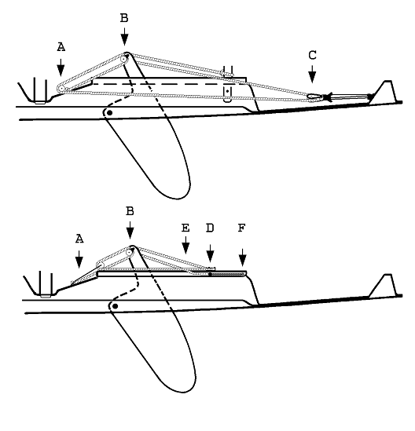
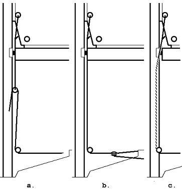

# BESCHLÄGE
{: .no_toc }

## Inhalt
{: .no_toc .text-delta }

1. TOC
{:toc}
---

## Fockholepunkt

## Allgemeines

Der Focktrimm ist im Wesentlichen durch den Fockschotholepunkt bestimmt. Die Lage des Holepunktes bestimmt den Fockwinkel und die Profiltiefe der Fock. Außerdem bestimmt die Höhe des Holepunktes, wieviel Mastfall (Neigung des Mastes nach Achtern) gefahren werden kann. Alle drei Parameter bestimmen stark das Am-Wind-Verhalten. Die optimale Auslegung des Fockholepunkt ist also für die Leistung des JETONs auf der Kreuz sehr wichtig.

Die serienmäßige Holepunktschiene der Klepper- und Grubenbote liegt eindeutig an der falschen Stelle, so daß mit dieser Konstruktion ein JETON keine befriedigende Höhe läuft. Die serienmäßige Belegung in Luv ist ebenfalls nicht akzeptabel.

Im Jahrbuch 1984/85 habe ich einen Überblick über die damals benutzten Holepunktkonstruktionen gegeben. Dies war in Zuge der Diskussion um die Freigabe der Holepunkte. Einige der Konstruktionen sind heute überholt, werden jedoch teilweise noch gefahren. Hier werden nur zwei Konzepte beschrieben, die sich bewährt haben. Als Ergänzung wird noch der Holepunkt mit Lee-Belegung auf der Originalschiene angeführt. Alle heute benutzten Konstruktionen haben die Belegung in Lee. Die Belegklemme sollte innen am Seitentank montiert sein, damit das Deck frei zum Sitzen ist. Kein Boot aus der Regattaszene fährt mit der auch heute noch von Gruben angebotenen Luvbelegung und Fockschotführung.

### Belegung

Bei beiden Konstruktionen wird die Fockschot auf einer Klemme, die mit einer Umlenkrolle auf einem Böckchen am Seitentank montiert ist, belegt. Das Böckchen ist als Nachrüstbeschlag über die ASJETON zu beziehen. Im Handel erhältliche Teile sind teurer und für den JETON weniger gut geeignet.

### Holepunkt auf Schiene

Der Fockholepunkt befindet sich auf einer Schiene, die innen am Seitentank befestigt ist. Der Holepunkt liegt ca. 6 cm unter der Decksoberkante und kann mit Hilfe der Schiene längsschiffs verstellt werden. Da das Cockpit in diesem Bereich nach hinten breiter wird läuft die Schiene etwas schräg. Die Schiene ist meistens eine einfache Lochschiene. Sie kann direkt am Seitentank angeschraubt werden (Abb. 5-1b). Dann ist ein Rutscher mit einem Winkel, auf dem dann die Rolle stehend montiert wird von Vorteil. Es kann jedoch auch ein Winkelprofil benutzt werden, das eine horizontale Montage der Schiene erlaubt (Abb. 5-1a). Die Rolle kann dann direkt auf dem Rutscher stehend montiert werden.

#### Varianten:
Einige Bastler haben auf dem Winkel gleich auch noch die Belegklemme untergebracht.

**Abb. 5-1 Schienen für Fockholepunkt, a. Auf Winkelschiene, b. Direkt am Seitentank**

Benutzt man den Winkel auf dem Rutscher, kann leicht auch noch eine seitliche Verstellbarkeit des Holepunktes erreicht werden. Eine besonders vornehme Lösung ist ein fernverstellbarer Holepunkt. Die Lochschiene wird dann durch eine kleine Travellerschiene ersetzt und der Holepunkt auf dem Travellerschlitten montiert. Abb. 5-2 zeigt die Anordnung der Beschläge und Vorschläge für die Schotführung der Holepunktfernverstellung. Die Verstellschot kann auch auf dem Schwertkastenkragen belegt werden (Abb. 5-12). Es gibt im Handel auch, allerdings zu stolzen Preisen, komplette Systeme mit Lochschiene oder Traveller auch mit zusätzlicher seitlicher Verstellbarkeit des Holepunktes. Wer selbst basteln will, kann die alte auf dem Deck montierte Holepunktschiene benutzen und sollte sich im Metallhandel entsprechende Aluwinkel besorgen.

**Abb. 5-2	Fockholepunkt auf Schiene Führung der  Holepunktfernverstellung**

### Freifliegender Holepunkt mit Luv-Verstellung

Nach Walter Stupp

Der Holepunkt ist an einer Rolle befestigt, die frei auf der Verstellschot des laufen kann. Obwohl diese Konstruktion einfach und preiswert ist, hat sie eine Reihe von Vorteilen (s.u.). In einem Schiff mit Traveller ist die Verstellschot wie folgt zu führen (Abb. 5-3): Die Verstellschot ist direkt hinter dem Mast auf dem Kielschwein fest angebracht (A). Es können die Schrauben, mit denen die Ausreitgurte festgemacht sind benutzt werden. Das andere Ende läuft über eine Rolle, die den zweiten Bezugspunkt des Holepunktes bildet (B). Die Verstellschot wird am Traveller nochmals umgelenkt (C) und auf der Luvseite auf der Trimmbank belegt.

**Abb. 5-3	Freifliegender Fockholepunkt**

Diese Führung eignet sich nicht so gut bei einem Schiff mit Reitbalken und Schwertkastenkragen, da hier die Verstellschot über den Schwertkasten laufen würde. Hier sollte sollte das feste Ende der Verstellschot außen liegen (2), die Rolle auf dem Kielschwein angebracht werden (1). Die Verstellschot kann dann unter dem Schwertkastenkragen geführt werden und belegt werden wie in Abb. 5-2. Alternativ kann die Verstellschot durch einen Schlitz nach oben geführt und auf dem Schwertkastenkragen belegt werden wie in Abb. 5-12.

### Holepunkt auf der serienmäßigen Schiene

Die beiden oben beschriebenen Konstruktionen erfordern, wenn sie bei einem alten Boot nachgerüstet werden einen erheblichen Umbauaufwand. Es müssen Inspektionsluken eingebaut werden, Versteifungen geklebt werden und Teile am Rumpf angeschraubt werden. Montiert man einen Holepunkt mit Lee-Belegung auf der serienmäßigen Schiene ist alles viel einfacher. Bauanleitung in Kapitel 6.

Die Holepunktsysteme im Vergleich:

Holepunkt auf Schiene:

* Das Deck ist frei zum sitzen.
* Das System funktioniert auch ohne Fernverstellung.
* Alles ist festgeschraubt und fliegt nicht im Cockpit herum.
* Fernverstellung von Luv aus ist möglich aber nicht preiswert.

Freifliegender Holepunkt:

* Das Deck ist frei zum Sitzen.
* Der Platz im Cockpit wird nicht verbaut
* Fernverstellung von Luv aus ist preiswert.
* Verstellbarkeit in weiten Grenzen (entspricht Fockleitschiene von ca. einem Meter Länge)
* Raumschots liegt der Holepunkt automatisch weit vorn.
* Bei Nachrüstung ist eine Verstärkung des Tanks nur für das Böckchen mit der Belegklemme nötig.

Holepunkt auf der Originalschiene:

* Keine Einbauten am Rumpf.
* Nach wie vor stört der Fockholepunkt auf Deck.

## Großschotführung

### Belegung

Die serienmäßige Belegung der Großschot ist eine Klemme auf dem Seitendeck.  Falls man diese Art der Belegung bevorzugt, sollte man wenigstens eine leichtgängige Schotklemme benutzen. (SERVO 22 von Spring), besser noch eine kugelgelagerte Klemme, HK150 (Harken).

Auf fast allen Regattaschiffen hat sich eine Mittenbelegung durchgesetzt, entweder eine Rolle kombiniert mit einer Curryklemme, oder der Mubirblock.

**Abb. 5-3	Abb. 5-4	Großschotbelegung, a., b. mit Großschottisch c. Montage auf  Schwertkastenkragen**

Leider gibt es beim JETON keine Stelle, die sich zur Montage einer solchen Einrichtung eignet. Es ist also ein Spezialteil notwendig. Abb. 5-4 a und 5-4 b zeigen den Großschottisch, wie sie vor einiger Zeit als Nachrüstbeschläge angeboten wurden und auf den Booten der Berliner Serie eingebaut wurden. Der Beschlag in Abb. 5-4b ist die bessere Lösung, weil die Großschotbelegung weiter vorne liegt. Man hat mehr Platz in der Wende. (Bauanleitung in Kapitel 6). Die in Abb. 5-4 b. angegebene Höhe (H) kann je nach Umriß des Schwertes (vgl. Abschnitt Schwert) variiert werden. Eine gute Montagemöglichkeit bietet ein Schwertkastenkragen. Wird ein Schwert mit elliptischem Umriß (vgl. Abb. 5-8) benutzt, kann direkt oben aufgeschraubt werden. Abb. 5-4c zeigt die Anordnung der Robert-Franz-JETONs mit Reitbalken und Drahtdreieck. Die Großschotbelegung liegt bewußt weit vorne.

### Traveller oder Drahtdreieck

Es gibt eine Reihe von Argumenten, die für den Traveller oder das Drahtdreieck sprechen (siehe auch den Artikel von Erich Beer im Anhang):

Traveller:
* Der Traveller ist eine zusätzliche Trimmeinrichtung, die ein Flachtrimmen des Großsegels ermöglicht.

* Der Traveller kann als Querverband zusätzliche Stabilität bringen.

Drahtdreieck:

* Die Funktion "Dichtholen" wird von der Funktion "Niederholen" getrennt. Die Bedienung wird dadurch einfacher. Eine Strippe fällt weg. Die Wirkung des Travellers wird dann durch den Baumniederholer erreicht. Dann kann das Großsegel allein durch die Großschot getrimmt werden. Voraussetzung ist, daß der Baumniederholer ausreichend übersetzt und die Mastbiegung im Decksbereich ausreichend kontrolliert wird. Außerdem muß der Großbaum stabil genug sein. (Der Ermat-Baum ist wohl etwas schwach.)
* Durch den mehr waagerechten Schotzug braucht man weniger Kraft.
* Der Traveller liegt im JETON sehr weit hinten. Dies wird noch durch die Rundung des Travellers verschärft. Sitzt der Steuermann hinter dem Traveller, wie es am bequemsten ist, ist das im allgemeinen zu weit hinten, außer bei viel Wind.
* Der Traveller liegt in Deckshöhe und hindert den Steuermann, nach vorne zu rutschen bzw. zu steigen.
* Durch die runde Form und die nicht sehr stabile Abstützung des Travellers ist eine mögliche Stabilisierung des Rumpfes, besonders des Schwertkastens nicht gegeben.

### Boote ohne Traveller

Bei einigen Booten wurde der Traveller ausgebaut, ohne daß eine zusätzliche seitliche Abstützung eingebaut wurde. Die Stabilität des Rumpfes und des Schwertkastens ist dadurch nicht beeinträchtigt. Alle diese Boote haben jedoch Schwertkastenkragen aus Holz.

Bei den Booten von Hans Spannheimer wurde der Traveller durch ein gerades Aluminumrohr ersetzt. Der Schwertkasten wurde durch eine stabile Abstützung, die an diesem Rohr befestigt wurde, an seinem hinteren Ende seitlich stabilisiert Die Robert-Franz-JETONs haben keinen Traveller. Ein Reitbalken dient zur seitlichen Stabilisierung des Schwertkastens und zum Anschrauben der Klemmen für die Trimmschoten.

### Heckgroßschotführung

Statt das Drahtdreieck im Bereich des Reitbalkens anzubringen, kann man auch die Großschot am Baumnock angreifen lassen. Dazu wird ein Drahtdreieck am Heck (ca. 30 cm vom Spiegel aus gemessen) angebracht.

**Abb. 5-5	Heckgroßschotführung**

Die Großschot läuft dann am Baum nach vorne, parallel dem Baumniederholer nach unten und über dem Schwertkasten wieder nach hinten. Die Belegung erfolgt auf einer drehbar angeordneten Curryklemme nach Umlenkung über einen stehenden Block (Abb. 5-5). Alternativ kann die Schot auch im Bereich des Reitbalkens nach unten gelenkt werden und dort z. B. auf einem Mubir-Block belegt werden (Abb. 5-4). Die Schenkel des Drahtdreiecks werden mit Fenderösen, die durch die Klebekante der Scheuerleiste geschraubt werden befestigt. Das Drahtdreieck in Abb. 5-5 hat zusätzlich eine Travellerfunktion. Die Großschot kann auf einer Rolle hin- und herlaufen, bzw. gezogen werden. Zur Umlenkung der Travellerschoten dienen zwei Rollen mit Hundsfott, die zwischen Dreiecksschenkel und Fenderöse montiert sind. Der Vorteil der Heckgroßschotführung ist, daß die Bewegungsfreiheit im Cockpit erheblich verbessert ist. Die Großschot behindert weder Steuermann noch Vorschoter. Die Beweglichkeit des Pinnenauslegers ist allerdings durch die Heckgroßschotführung etwas beschränkt. In der Wende muß er vorne herum geschwenkt werden. Dies erfordert einige Übung geht aber völlig problemlos.

### Die Talje

Die Talje der Großschot sollte vier oder fünf Parten haben. Bei sechs Parten hat man zuviel Schot zu bewegen. Eine vierfache Talje erfordert zwar 20% mehr Kraft ist aber in der Bedienung des Segels direkter und läuft leichter. Wer kräftemäßig gut drauf ist, kommt mit vier Parten aus. Es ist zu beachten, das die Kraft, die notwendig ist um die Schot zu holen auch davon abhängt wo am Großbaum die Großschot angreift, d. h. wie lang der Hebelarm ist. Setzt man die Großschot wie beim Robert-Franz-JETON etwas nach vorne braucht man also mehr Kraft.

Ein Drahtdreieck reduziert die notwendige Kraft etwas, da der Schotzug mehr waagerecht angreift. Für eine Heckgroßschotführung sind zwei Parten ausreichend.

## Spinnakerschot

### Führung

Die Spinnakerschot sollte endlos gefahren werden, d. h. Steuerbord- und Backbordschot werden mit den Enden zusammengeknotet oder sind aus einem Stück. Die Spinnakerschot sollte über drei Rollen auf jeder Seite laufen:

* Holepunktrolle

Diese Rolle liegt am Heck, oder je nach Geschmack und Spinnakerschnitt etwas weiter vorne, außen.

* Umlenkrolle am Heck innen.
* Umlenkrolle am Reitbalken bzw. Traveller.

Alle diese Rollen sollten unbedingt kugelgelagert sein. Abb. 5-6 zeigt die Anordnung der Spinnakerschotrollen. Die Umlenkrolle am Heck innen ist bei den Klepper- und Gruben-JETONs an der falschen Stelle montiert. Die Schot reibt auf dem Deck. Die richtige Position ist dort wo die flache Oberkante des Spiegels in den Seitentank übergeht, wie in der Abb. 5-6 sichtbar.

Bei älteren JETONs fehlt die außenliegende Holepunktrolle, so daß die Umlenkrolle am Heck effektiv der Holepunkt ist. Die außenliegende Holepunktrolle ist jedoch leicht nachzurüsten. Sie kann einfach durch die Klebekante geschraubt werden. Statt der Umlenkrolle am Traveller ist bei Klepper- und Gruben-JETONs ein Auge montiert. Dies ist völlig ungeeignet, da es der Schot viel zu viel Reibung bietet. Eine Rolle kann am Auge angeschäkelt werden. Alternativ können Fenderösen mit Rollen angeschraubt werden.

### Barberholer

Ganz wenige JETONs sind mit Barberholern für die Spinnakerschot ausgerüstet (Abb. 5-6). Die Spinnakerschot wird durch eine Leichte Rolle oder einen Nylonring gezogen, der am Barberholer befestigt ist. Mit dem Luv-Barberholer wird der Achterholer ganz an den Wantenpütting herangezogen. Mit dem Lee-Barberholer kann der Zugwinkel der Leeschot getrimmt werden.

### Belegung

Beim Spinnakern muß eigentlich nur der Achterholer (Luvschot) belegt werden. Der Achterholer läuft unter dem Haken am Wantenpütting durch und sollte auf einer Curryklemme direkt dahinter belegt werden. Wird ein Barberholer gefahren, braucht man den Haken nicht. Der Barberholer dient dann zur Führung des Achterholers. Auf Klepper- und Gruben-JETONs ist diese Klemme serienmäßig nicht vorhanden. Sie muß nachträglich montiert werden. Die auf Deck montierte Spinnakerschotklemme (neben der Travellerklemme) ist zur Belegung des Achterholers nicht geeignet. Die Schot sollte immer aus der Hand gefahren werden. Bei ruhigem Wind kann man die Schot auch schon mal belegen. Dazu eignet sich die bei Klepper- und Gruben-JETONs vorhandene Luvklemme neben der Travellerklemme. Man kann sich jedoch auch ein Böckchen mit einer Leebelegung ähnlich der Fockschotleebelegung bauen (Dazu gibt es leider keine Bauanleitung).

**Abb. 5-6	Spinnakerschot-Führung mit Barberholer und Topnantschot**

## Schoten

### Material

Großschot und Fockschot sollten aus 8 mm geflochtenem, vorgerecktem Tauwerk bestehen. 10 mm Schotenmaterial, wie es von Klepper und Gruben geliefert wird, ist teurer, schwerer, läuft unnötig schwer, und ist nur zu empfehlen, wenn man wegen der zarten Hände Probleme hat. Die Großschot ist meistens als vier oder fünffache Talje geschoren. Die Spinnakerschot sollte endlos gefahren werden. Am besten eignen sich verjüngte Spischoten (6-4mm) mit Kevlarseele oder aus Dynema).

### Längen

| Name | Länge | Bemerkung |
| ---- | ----- | --------- |
| Fockschot: | 8.50 m |  |
| Großschot: | 10.00 m | fünffache Talje |
| Großschot: | 8.00 m | vierfache Talje |
| Spischot: | 18.00-22.00 m | nach Geschmack |

### Schotrollen

Alle Schotrollen, besonders die der Spinnakerschot, sollten kugelgelagert sein.

## Schwert

### Übersicht

Das Schwert ist ein Teil des Bootes,  das die meisten JETON-Segler abgesehen von Kenterungen - noch nie vollständig gesehen haben. Die meisten kennen nur die Achterkante. Entsprechend wenig Aufmerksamkeit wir dem Schwert geschenkt. Dabei ist es ein für die Leistungsfähigkeit des Bootes von eminenter Wichtigkeit. Das Schwert hat die Aufgabe, die Abdrift des Bootes zu verhindern, vor allem auf Am-Wind-Kurs. Es wirkt dabei wie ein Tragflügel im Wasser. Die Auftriebskraft des Tragflügels wirkt der vom Segel erzeugten Seitenkraft entgegen.

Zwar kann im Prinzip ist jedes Brett, das den Abmessungen entspricht, und an den Rändern etwas abgeschrägt ist, als Schwert dienen, Profile, der optimale Umriß, die Stabilität, und die Oberfläche beeinflussen jedoch entscheidend die hydrodynamische Wirksamkeit des Schwertes und damit die Am-Wind-Leistung des Bootes.
Auch sollte man ein Schwert pflegen, d. h. ab und zu inspizieren und beschädigte Stellen ausbessern. Bei Holzschwertern sollte die Lackierung nicht zu große Schäden aufweisen.

### Stabilität/Haltbarkeit

Aus einem Artikel von Hans Spannheimer:

Es dürfte wenige JETON-Segler geben, die mit dem Originalschwert noch keinen Ärger gehabt haben. Der Grund des Ärgers ist immer der gleiche. Die Schwerter brechen bei stärkerer Belastung parallel zur Faserrichtung des Holzes. Bei den alten 20 mm-Schwertern genügte häufig schon ein starker böiger Wind, bei den neueren 28 mm-Schwertern knackst es spätestens, wenn man nach einer Kenterung aufs Schwert steigt. Da das von Klepper und Gruben verwendete Vollmahagoni in der Regel von bester Qualität ist, könnte man zumindest bei den 28 mm-Schwertern eine große Lebensdauer erwarten. Wenn dem nicht so ist, so liegt das an der sehr ungünstigen Form des Schwertes.

**Abb. 5-7	JETON-Schwert mit Kohlefaserverstärkung**

Segelt man am Wind, dann erzeugt der Wind nicht nur eine Vortriebskraft, sondern auch eine Querkraft. Diese Querkraft wird durch eine gleichgroße entgegengesetzte, am Schwert angreifende Kraft F kompensiert (Abb. 5-7). F wird in der Strömungstheorie als Auftrieb bezeichnet. F greift nicht, wie man zunächst vermuten könnte, im Flächenschwerpunkt des Schwertes an, sondern sehr viel weiter vorne. Beim JETON-Schwert ist dieser Angriffspunkt etwa 11 - 12 cm von der Vorderkante entfernt. An den Punkten A 1 und A 2 liegt das Schwert an der Unterkante des Schwertkastens auf. Das entstehende Drehmoment wird durch ein zweites, hervorgerufen durch eine im Punkt B angreifende Kraft (Abstützung an der Schwertkastenoberkante), kompensiert. Durch diese angreifenden Kräfte biegt sich das Schwert. Die größte Biegung tritt im Schnitt C-C, auf. Man kann nun diese Biegung in eine Komponente parallel zur Faserrichtung des Holzes und in eine senkrecht dazu zerlegen. Da die Biegefestigkeit senkrecht zur Faser bei den meisten Hölzern weniger als 5 % des Wertes parallel zur: Faser beträgt, bricht das Schwert im Schnitt D-D. Dies gilt auch für stabverleimte Schwerter.

**Fazit:** Schwerter sollten immer mit Glasfaser/Kohlefaser und Epoxidharz verstärkt sein. Das gilt vor allem für profilierte Schwerter, die ja an der Achterkante dünn auslaufen. Eine Möglichkeit ist, das Schwert mit einem Steifen Kohlefasermaterial und Epoxidharz zu verstärken. In Kapitel 6 ist Hans Spannheimers Methode zur Verstärkung des Schwertes beschrieben. Diese ist vor allem zur Verstärkung bereits bestehender Schwerter geeignet. Soll ein neues Schwert angeschafft werden, sollte man ein Schwert wählen, das bereits ganzflächig verstärkt ist.

### Material

Die Originalschwerter von Klepper oder Gruben sind aus Vollholz-Mahagoni oder Sperrholz. Optimal sind stabverleimte Schwerter mit Verstärkung aus Glasgewebe, Kohlefaser und Epoxidharz.

### Dicke

Die Schwertkästen der älteren Boote haben eine Lichte Weite von 24 mm. Die dazu passenden Schwerter sind 20 mm Dick. Die Schwertkästen der aktuellen Formen haben eine lichte Weite von 30 mm. Hier können Schwerter mit der maximalen Dicke von 28 mm gefahren werden. Diese maximale Dicke sollte auch in jedem Falle ausgenutzt werden.

### Umriß

Der Umriß der Schablone des JETON-Schwertes ist trapezförmig mit abgerundeten Ecken. Die Länge des Schwertknaufes der bisherigen Schwerter erfordern, daß das Schwert auch in seiner tiefsten Position nach hinten angestellt ist. Außerdem würde die maximale Tiefe des Schwertes überschritten. Ein trapezförmiger Umriß ist nicht das schlechteste, besser wäre jedoch ein elliptischer (Anhang). Allerdings hat sich gezeigt, daß eine Anstellung des Schwertes nach hinten, die ja so stromlinienförmig aussieht, die Leistung des Schwertes verschlechtert. Die Klassenvorschrift legt nur den maximalen Umriß des Schwertes fest. Über den Anstellwinkel sagt sie nichts aus, allerdings ist die maximale Tiefe des Schwertes begrenzt.

Man kann also den Schwertumriß "elliptisch machen". Dabei sollte man darauf achten, daß die Vorderkante gerade wird (Abb. 5-8). Den Anstellwinkel kann man verkleinern, wenn die maximale Tiefe nicht überschritten wird. Verlängert man den Schwertknauf etwas, und baut zusätzliche Führungen in den Schwertkasten ein, kann man das Schwert weiter in die Senkrechte kippen.

Es gibt bereits elliptische Schwerter. Diese sind flächenmäßig etwas kleiner als die Originalschwerter. Nach meinen Erfahrungen wird die geringere Fläche bei weitem durch den optimalen Umriß wettgemacht. Probleme mit der Abdrift am Wind gibt es bei keiner Windstärke. Nur wenn das Boot (fast) steht, keine Strömung am Schwert ist, hat man das Gefühl, die Fläche könnte größer sein. Bisher wurde die Wirkung des geringeren Anstellwinkels des Schwertes nicht ausprobiert. Die nächsten neuen Boote werden zeigen, was es bringt.

### Profil

Die Diskussion über Profile ist ähnlich der Diskussion über Segelschnitte. Es ist viel gefühlsmäßiges drin. Die Wirkung der Details der Profile, d. h. des genauen Verlaufs der Profilkontur, ist sehr schwer zu prüfen. Man ist darauf angewiesen, daß die Hersteller gute Profildaten benutzen, die irgendwie, durch Modellrechnungen oder im Schlepptank optimiert wurden. Eins ist jedoch klar: jedes stromlinienförmige Profil ist besser als ein Brett mit schrägen Kanten. (Bastelvorschlag von Jupp Zavelberg in Kapitel 6).

Im Anhang wird Grundsätzliches über Profile diskutiert. Für das JETON-Schwert folgt daraus. Es eignen sich sowohl Auftriebsprofile als auch Laminarprofile. Auch mit einem Laminarprofil kommt am Schwert ein Stömungsabriß selten vor, da die Aufriebsdrücke nicht so groß sind. Gestauchte Profile sieht man heute seltener.

### Gewicht

In der Klassenvorschrift ist interessanterweise nur ein Maximalgewicht des Schwertes (8 kg) festgelegt, obwohl das Gewicht des Schwertes für die Stabilität einer Jolle keine Rolle spielen soll. Man sollte also das Schwert so leicht wie möglich machen. Ein gutes stabverleimtes mit Glas/Epoxy verstärktes Schwert wiegt höchstens 6 kg. Will man noch leichter werden, wird es teurer.

### Führung des Schwertes

Die Führung des Schwertes sollte so beschaffen sein, daß das Schwert im Schwertkasten in jeder Position seitlich fixiert ist. Hat es Spiel, steht es infolge des Auftriebsdruckes auch bei waagerechter Schwimmlage nicht senkrecht im Wasser, was seine Wirkungsweise verschlechtert. Um das Schwert zu führen, muß es an drei Punkten festgelegt werden, vorausgesetzt das Schwert ist in sich steif genug. Das Konzept der Schwertführung beim JETON ist im Prinzip richtig, wenn man davon absieht, daß ein anders geformter Schwertknauf und ein nach vorne verlängerter Schwertkasten für die Stabilität günstiger wäre. Die drei festen Punkte sind:

* der Schwertdrehpunkt (A),
* der Auflagepunkt auf der vertikalen Führungsleiste im Schwertkasten unten (B),
* der Auflagepunkt auf der Führungsleiste oben (C).
Leider ist dies nur "im Prinzip" so, denn:
* im angestellten Zustand wandert der Schwertknauf nach vorne und liegt nicht mehr auf der Führungsleiste auf.
* Die lichte Weite zwischen den Führungsleisten ist oben schon größer als die Schwertdicke (ca. 33 mm beim den aktuellen Formen) und wird außerdem nach unten noch größer.
Deswegen klappert das JETON-Schwert bekanntermaßen im Schwertkasten. Für eine richtige Schwertführung braucht man
* eine horizontale Führungsleiste an der Schwertkastenoberkante,
* eine vertikale Führungsleiste, wie bereits vorhanden. Der Abstand aller Führungen sollte genau der Schwertdicke entsprechen.

Im abgefierten Zustand liegt das Schwert mit seinem gesamten Knauf auf der vertikale Führungsleiste auf. Im angestellten Zustands liegt der Schwertknauf auf der horizontalen Führungsleiste auf. Auf der vertikalen Führungsleiste liegt die dickste Stelle des Profils. Das Schwert ist also in jeder Stellung fixiert. Als Führungsleisten eignen sich eingeklebte Stücke Segellatte. Die vertikalen Stücke müssen allerdings keilförmig sein (Bauanleitung in Kapitel 6.).

**Abb. 5-8	Schwertführung, Schwert mit elliptischem Umriß**

### Schwertfall

Es gibt verschiedene Möglichkeiten, das Schwertfall zu führen:

* Das Schwertfall besteht aus einem separatem Auf- und Niederholer. Beide werden auf je einer Klemme belegt. Wenn der Aufholer geholt wird, muß der Niederholer gefiert werden. Zur Milderung dieses Umstandes kann in den Niederholer ein Gummistropp eingefügt werden.
* Die endlose Schwertfallführung. Auf- und Niederholer sind "endlos", d. h. aus einem Ende, das über Rollen zurückgeführt wird. Der Vorteil dieser Konstruktion ist, daß keine Klemme notwendig ist. Das System hat genug Reibung, so daß das Schwert fixiert ist. Vorschoter und Steuermann können beide das Schwert bedienen. Wichtig ist, daß die notwendige Längenänderung des endlosen Schwertfalles durch einen Gummistropp ausgeglichen wird. Abb. 5-9a zeigt eine Konstruktion, wie sie ohne großen Aufwand im Klepper- oder Gruben-JETON eingebaut werden kann. Das Schwertfall läuft über eine Rolle, die teilweise bereits vorhanden ist (A), eine Rolle, die über ein Gummistropp am Innenspiegel befestigt ist (C) und zwei liegende Rollen, die am Schwertknauf angeschraubt werden (B). Die Rolle C kann auch z. B. an der Travellerabstützung angeknotet werden. Dann läuft das Schwertfall nicht durch das achtere Cockpit. Besonders elegant läßt sich dieses Prinzip mit einem Schwertkastenkragen realisieren (Abb. 5-9b). Die Rolle C wird durch zwei liegende Rollen, die auf dem Schwertkastenkragen montiert sind (D), ersetzt. Das Fall verschwindet durch ein Loch im Schwertkastenkragen (E). Der Gummistropp liegt unter dem Kragen. Die Rolle A muß an einem kurzen Draht- oder Kevlarstropp befestigt werden. Bauanleitung in Kapitel 6.

### Schwertlippen

Für Schwertlippen verwendet man am besten Streifen aus Mylarfolie. Es eignet sich das Schablonenmaterial der Segelmacher (z.B. von Clown). Es gibt im Bootsbedarfshandel aber auch Mylar mit Gewebebeschichtung von der Rolle. Dieses Material ist zum Ankleben ohne Aluleisten und Schrauben gedacht, was beim JETON aber nicht so gut geht.

**Abb. 5-9	Endlose Schwertfallführung, a. Im Klepper/Gruben-JETON, b. Mit Schwertkastenkragen**

## Ruder/Ruderanlage

### Umriß

Der maximale Umriß des des JETON-Ruders ist durch die Klassenvorschrift festgelegt. Es darf aber beliebig kleiner sein. Der Maximalumriß ist bei leichtem Wind eventuell gut, als Allroundruder jedoch unten zu breit. Wie im Anhang beschrieben, ist ein elliptischer Umriß, der sich in Rumpfnähe etwas verjüngt, optimal. Ein solcher Umriß läßt sich sehr gut in die Originalschablone einbeschreiben und ist somit konform mit der Klassenvorschrift. Abb. 5-10. Solche Ruder werden von zwei Herstellern angeboten und haben sich bewährt. Die geringere Fläche wird durch den optimalen Umriß aufgewogen. Raumschots wünscht man sich manchmal etwas mehr Ruderwirkung, aber das ist eher ein generelles Problem.

**Abb. 5-10	Ruderumriß/Balancierung**

### Balancierung

Die Klassenvorschrift legt den Anstellwinkel des Ruders in keiner Weise fest. Die maximale Tiefe von TR=600mm ist allerdings einzuhalten. Wie sollte man den Anstellwinkel des Ruders wählen?

* Das Ruder sollte möglichst senkrecht stehen.
* Das Ruder sollt leicht balanciert sein.

Bei einem völlig balancierten Ruder liegt der Druckpunkt in der Drehachse, so daß man keinen Ruderdruck spürt. Dies ist nicht erwünscht. Andererseits sollte das Ruder ganz leicht bedienbar sein. Der Druckpunkt sollte also nicht allzuweit hinter der Drehachse liegen. Benutzt man den Originalumriß und den Original-Klepper-Ruderkopf, ist der Anstellwinkel des Ruders vorgegeben, die Vorderkante des Ruders hat etwa die Richtung des Spiegels die Hinterkante des Ruders ist nach hinten angestellt. In dieser Stellung liegt der Druckpunkt des Ruders deutlich hinter der Drehachse. Das Ruder ist also alles andere als ein Balanceruder.
Eine gute Faustregel ist: die Vorderkante des Ruderblattes sollte die Drehachse schneiden oder sie um bis zu 30 mm überschreiten (Abb. 5-10).

### Profil

Wie beim Schwert werden auch hier Auftriebsprofile und Laminarprofile verwandt. Auftriebsprofile haben sich bewährt. Laminarprofile eignen sich weniger, da sie einen sehr sensiblen Umgang mit dem Ruder erfordern, sie haben aber einen geringeren Strömungswiderstand.

### Dicke

Die Dicke von 30 mm ist optimal und sollte immer ausgenutzt werden.

### Gewicht

Die gesamte Ruderanlage sollte nicht mehr als das durch die Klassenvorschrift festgelegte Minimalgewicht von 4 kg haben. Originalruder aus Mahagoni sind im allgemeinen zu schwer. Gute stabverleimte, mit Glas/Epoxy verstärkte Ruder bringen etwa das richtige Gewicht auf die Waage.

### Material

Die Originalruder sind wie die Schwerter entweder aus Vollholz-Mahagoni oder Sperrholz. Optimale Ruder sind aus stabverleimtem Material mit Verstärkung aus Glasgewebe oder Kohlefaser mit Epoxidharz.

### Ruderanlage

Eine gute Ruderanlage für den JETON zu bekommen, ist nicht einfach. Der Originalruderkopf von Klepper ist aus Aluminiumdruckguß. Er ist zwar sehr stabil aber unnötig schwer.

Gute Ruderköpfe von Cee-Vee gibt es bei Vesting & Siegmund.

Bei Klepper sind die JETON-Pinnen irgendwann ausgegangen. Deshalb hat man den JETON zeitweise mit Trainer-Pinnen ausgerüstet, die viel zu kurz sind. Die richtige Länge der Pinne ist mindestens 1 m, gemessen vom Ruderbeschlag aus. Eine zu kurze Pinne verleitet den Steuermann, zu weit hinten zu sitzen. Man kann die Pinne noch länger machen, wenn man schlank ist oder eine Großschotbelegung benutzt die weiter vorne liegt. Leider ist das Vierkantprofil des Pinnenrohres im Metallhandel nicht erhältlich. Will man den Originalruderkopf mit einer längeren Pinne ausrüsten, hilft nur der radikale Bastelvorschlag in Kapitel 6.

Der Original-Pinnenausleger ist eine einfache Latte. Besser ist ein handelsüblicher Ausleger aus Aluminiumrohr mit einem Golfschlägergriff. Der Pinnenausleger sollte 1.10 m lang sein. Der Ausleger sollte am Ende der Pinne angebracht sein und nicht wie bei der Original-Ruderanlage 12 cm weiter hinten. Dies verkürzt die effektive Länge der Pinne unnötig.

### Ruderbeschläge
Die Original-Ruderbeschläge von Klepper könnten etwas stabiler sein. Die von Gruben sind zu groß. Im Handel erhältliche Ruderbeschläge sind meistens für den JETON wegen der überstehenden Abrißkante zu kurz.

## Trimmschoten

Die Originalausrüstung der Klepper und Grubenboote ist eher spartanisch. Die Trimmschoten sind alle da, jedoch nicht während der Fahrt und schon gar nicht in Ausreitposition zu bedienen. Begnügt man sich damit, sind die Trimmschoten kein Thema. Auf einem Regattaschiff ist es sehr hilfreich, wenn nicht unerläßlich, daß die Trimmeinrichtungen während der Fahrt bedient werden können, d. h. sie müssen gut erreichbar und leichtgängig sein. Die Führung der Trimmschoten ist sehr von der persönlichen Präferenz der Mannschaft abhängig. Abb. 5-11 stellt die Beschlagsausrüstung der Boote der Berliner Serie dar.

**Abb. 5-11	Trimmschoten am Berliner JETON**

### Belegung

Die meisten Trimmschoten kommen vom Mast her und laufen ins Cockpit, wo sie belegt werden. Trimmschoten sollten möglichst aus der Ausreitposition bedienbar sein. D. h. die Klemmen sollten außen liegen, wenigstens sollte die Zugrichtung quer zur Mittschiffslinie, so daß sie von der Seite aus geholt werden können.

* Curryklemmen an der Travellerabstützung
Diese Möglichkeit eignet sich nur für selten benutzte Schoten, da die Zugrichtung nach achtern ist. Der Steuermann muß sich ins achtere Cockpit begeben.
* Curryklemmen seitlich am Schwertkasten mit Zugrichtung nach hinten.

Hierfür gilt dasselbe wie für die Belegung an der Travellerabstützung. Es sei darauf hingewiesen, daß am Schwertkasten keine Verstärkungen zum Festschrauben der Klemmen existieren, außer bei der Travellerabstützung. Bei einem neuen Boot kann man sie sich natürlich einkleben lassen, wenn man rechtzeitig daran denkt.

* Curryklemmen auf dem Schwertkastenkragen.

Ein Schwertkastenkragen, sei es ein aus Holz selbst gebauter (Kapitel 6), ein nachgerüsteter von Robert Franz oder ein serienmäßiger, eignet sich sehr gut zur Montage der Trimmschotenbelegung. Die Trimmschot kann entweder über dem Kragen laufen oder darunter und durch einen Schlitz oder eine Rollendurchführung nach oben geführt werden. Hinter der Klemme sollte eine Holerolle montiert sein, so daß man seitlich ziehen kann (Abb. 5-12).

**Abb. 5-12	Curryklemme auf Schwerkastenkragen**

* Curryklemmen auf dem Reitbalken
Hat man einen Reitbalken nach Art der Robert-Franz-JETONs können die Klemmen direkt darauf montiert werden mit Zugrichtung nach außen. Die Trimmschoten werden am Schwertkasten nach außen umgelenkt.

* Trimmbank Dies ist ein Nachrüstbeschlag, der außen an der Travellerschiene angeschraubt ist. Die Trimmschoten werden mit Rollen, die an der Travellerabstützung montiert sind nach außen umgelenkt (Abb. 5-2, 5-3, 5-11.). In Kapitel 6 findet man eine Einbauanleitung für die Trimmbank. Wenn die Trimmschoten außen belegt werden sollen, müssen sie zwei Holetampen haben. Dies wird erreicht man mit einem Verdoppler (Abb. 5-13). Ein Verdoppler ist gleichzeitig immer auch eine Übersetzung und halbiert die Kraft.

**Abb. 5-13	Verdoppler**

Bei Fock-Cunningham, Fockholepunktverstellung und Topnantgibt es noch andere Systeme, die dort beschrieben sind.

### Baumniederholer

Der Baumniederholer soll des Steigen des Baumes verhindern. Er hält dabei das Großsegel flach. Dies ist vor allem bei gefierter Großschot wichtig. Ein Teil dieser Aufgabe kann vom Traveller übernommen werden. Fährt man ein Drahtdreieck, muß der Baumniederholer so ausgelegt werden, daß er die ganze Arbeit macht.

Der Baumniederholer kontrolliert außerdem die Mastbiegung im unteren Bereich und die Verwindung des Großsegels, bzw. die Öffnung des Achterlieks. Der serienmäßige Baumniederholer ist eine dreifache Talje, die auf einer integrierten Kammklemme belegt werden kann. Eine vierfache Untersetzung ist erfahrungsgemäß unterdimensioniert; 8-fach ist ausreichend. In Abb. 5-14 werden zwei Lösungen mit 8-facher (a) und 16- facher (b) Übersetzung beschrieben.

**Abb. 5-14	Baumniederholer, a. Kaskade, b. mit Bierkasten**

Die Umlenkung nach hinten erfolgt bei beiden Konstruktionen beidseitig am Mastfuß. Die Trimmschoten werden am Reitbalken bzw. Traveller nach außen umgelenkt und dort belegt. Soll eine einzelne Trimmschot verwendet werden, wird diese nur einseitig nach hinten geführt und in der Mitte an der Travellerabstützung belegt.

### Cunningham

Die Cunningham dient zur Streckung des Großsegelvorlieks. Dadurch wird das Großsegel flacher und der Bauch wird nach vorne verlagert. Die Cunningham kann im Prinzip direkt, d. h. ohne Übersetzung gefahren werden. Besser ist jedoch eine zweifache Übersetzung. Die Übersetzung kann am einfachsten dadurch erreicht werden, daß die Cunninghamschot direkt durch die Cunninghamkausch gezogen, auf beiden Seiten am Mastfuß nach hinten umgelenkt wird und außen am Traveller bzw. Reitbalken belegt wird. Eine Übersetzung mit einer Rolle ist jedoch leichtgängiger. Dies kann auch gleich die Verdopplerrolle sein. Da der Hub der Cunningham nicht sehr groß ist, kann sie einfach nach hinten umgelenkt werden. Die Verdopplerrolle läuft dann zwischen Mast und der Vorderkante des Schwertkastens (Abb. 5-15 b.). Soll die Cunningham in der Mitte am Reitbalken, bzw. der Travellerabstützung belegt werden, kann sie entweder mit einer Rolle zwischen Mast und Umlenkung nach hinten (Abb. 5-15 a.) oder mit einer Rolle kurz vor der Belegung übersetzt werden. Besonders elegant ist eine im Mast laufende Cunningham, die durch einen Schlitz unterhalb des Lümmelbeschlages in den Mast geführt und dann mit einer Einlaßrolle nach hinten umgelenkt wird (Abb. 5-15 c.).

**Abb. 5-15	Cunningham, a. Einfache Belegung, b. Für Belegung außen, mit Verdoppler, c. Innenlaufende Cunningham.**

### Unterliekstrecker

Der Unterliekstrecker dient zum Trimmen des Großsegelprofils im unteren Bereich. Moderne Großsegel sind meist bis zur untersten Bahn durchprofiliert. Zwischen der untersten Bahn und dem Unterliek befindet eine "Ellipse". Dies ist eine weitere Bahn aus weichem Tuch. Ist der Unterliekstrecker gefiert, liegt diese Bahn waagerecht zwischen Baum und der ersten Bahn. Holt manden Unterliekstrecker dicht, wird die unterste Bahn flachgezogen und die Ellipse bildet eine Falte längs dem Baum. Der Unterliekstrecker ist daher ein wichtiges Trimminstrument, da er z. B. auf Am-Wind-Kurs dichtgenommen und raumschots gefiert werden muß. Er sollte also auf jeden Fall aus dem Cockpit möglichst von außen bedienbar sein.

Zur Führung des Unterliekstreckers ist eine Umlenkrolle am Baumnock und eine am vorderen Nock notwendig. Je nach Geschmack sollte der Unterliekstrecker untersetzt sein. Man braucht ziemlich viel Kraft um ihn dichtzuholen. Andererseits verhindert eine zu große Übersetzung, daß er sich bei leichtem Wind auch fieren läßt. Ich denke, daß eine vierfache Übersetzung gut ist. Diese wird erreicht durch eine Kaskade von zwei zweifachen Übersetzungen. Die letzte Stufe sollte der Verdoppler sein (Abb. 5-16 b). Eine weitere zweifache Übersetzung kann entweder im Baum (Abb. 5-16 a) oder am Baumnock (Abb. 5-16 b) angebracht werden. Benutzt man beides, erhält man eine achtfache Übersetzung. Wenn man keinen Verdoppler braucht, sollte man, um eine vierfache Übersetzung zu erreichen, sowohl im Baum, als am Baumnock je eine zweifache Übersetzung benutzen.

**Abb. 5-16 Unterliekstrecker, a. für Belegung in der Mitte, mit Übersetzung im Baum, b. mit Verdoppler für beidseitige Belegung, und Übersetzung am Nock**

Beim Ermat-Baum existiert keine Einrichtung zur Führung des Unterliekstreckers. Hier muß eine Umlenkrolle hinten auf das Baumnock genietet werden. Sehr gut eignet sich die Spinnkerfallrolle, die ja übrigbleibt wenn man sich ein innenlaufendes Spinnakerfall eingebaut hat. Vorne muß eine normale Einlaßrolle eingebaut werden. Der Klepperbaum hat hinten bereits eine Umlenkrolle, so daß man nur die Einlaßrolle vorne braucht. Bäume von Superspars und Proctor haben bereits alle Rollen.

### Fock-Cunningham

Die Fock-Cunningham dient zum Strecken des Fockvorlieks. Sie ist oft vom Segelmacher bereits in Form eines Bändsels vorhanden. Mancher möchte sie jedoch zum Trimm benutzen und muß sie deshalb nach hinten führen. Dazu wird am Vorstagbeschlag eine liegende Rolle montiert, die die Fock-Cunningham (Kevlar oder Dyneema) nach hinten umlenkt. Die Fock-Cunningham sollte zweifach übersetzt werden. Als Belegung reicht eine Kammklemme am Mastcontroller. Eine andere Möglichkeit ist, einen Verdoppler zu benutzen und zwei Kammklemmen auf Deck im Bereich des Wellenbrechers zu montieren.