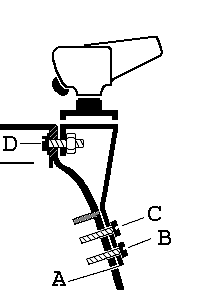

# UMBAUMASSNAMEN/BASTELANLEITUNGEN

## Inhalt

* [Mast vermessen](#mast-vermessen)
    * [Werkzeug](#werkzeug)
    * [Anleitung](#anleitung)
* [Umbau der Meßmarke MVS](#umbau-der-me-marke-mvs)
    * [Material](#material)
    * [Werkzeug](#werkzeug-1)
    * [Anleitung](#anleitung-1)
* [Wenn man einen neuen Mast braucht...](#wenn-man-einen-neuen-mast-braucht)
    * [Fabrikate](#fabrikate)
* [Mastcontroller mit Abstützung aufs Seitendeck](#mastcontroller-mit-abst-tzung-aufs-seitendeck)
    * [Material](#material-1)
    * [Werkzeug](#werkzeug-2)
    * [Anleitung](#anleitung-2)
* [Fockholepunkt auf Schiene](#fockholepunkt-auf-schiene)
    * [Material](#material-2)
    * [Werkzeug](#werkzeug-3)
    * [Vorarbeiten](#vorarbeiten)
    * [Festlegen der Position](#festlegen-der-position)
    * [Einbauanleitung](#einbauanleitung)
* [Freifliegender Holepunkt](#freifliegender-holepunkt)
    * [Material](#material-3)
    * [Werkzeug](#werkzeug-4)
    * [Anleitung](#anleitung-3)
* [Leeschotbelegung auf Originalschiene](#leeschotbelegung-auf-originalschiene)
    * [Material](#material-4)
    * [Anleitung](#anleitung-4)
* [Großschottisch](#gro-schottisch)
    * [Material](#material-5)
    * [Werkzeug](#werkzeug-5)
* [Einbauanleitung Großschottisch A](#einbauanleitung-gro-schottisch-a)
* [Einbauanleitung Großschottisch B](#einbauanleitung-gro-schottisch-b)
* [Innenlaufendes Spifall/innenlaufender Topnant](#innenlaufendes-spifall-innenlaufender-topnant)
    * [Material](#material-6)
    * [Anleitung](#anleitung-5)
* [Spifalltalje](#spifalltalje)
    * [Material](#material-7)
    * [Anleitung](#anleitung-6)
* [Salingverstellung preiswert](#salingverstellung-preiswert)
    * [Material](#material-8)
    * [Werkzeug](#werkzeug-6)
* [Schwertkastenverstärkung](#schwertkastenverst-rkung)
    * [Anleitung](#anleitung-7)
* [Reparatur aufgerissener Schwertkasten oder Scheuerleiste](#reparatur-aufgerissener-schwertkasten-oder-scheuerleiste)
    * [Der Schaden](#der-schaden)
    * [Anleitung](#anleitung-8)
* [Schwertführung](#schwertf-hrung)
    * [Material](#material-9)
    * [Werkzeug](#werkzeug-7)
    * [Anleitung](#anleitung-9)
* [Schwertfallführung ohne Klemme](#schwertfallf-hrung-ohne-klemme)
    * [Material](#material-10)
    * [Anleitung](#anleitung-10)
* [Verbesserung des Schwertes](#verbesserung-des-schwertes)
* [Schwertreparatur](#schwertreparatur)
    * [Einleitung](#einleitung)
    * [Material](#material-11)
    * [Werkzeug](#werkzeug-8)
    * [Anleitung](#anleitung-11)
    * [Andere Materialien](#andere-materialien)
    * [Selbstbau von Sperrholzschwertern](#selbstbau-von-sperrholzschwertern)
* [Umbau der Originalruderanlage](#umbau-der-originalruderanlage)
    * [Material](#material-12)
    * [Werkzeug](#werkzeug-9)
    * [Anleitung](#anleitung-12)
* [Trimmbank](#trimmbank)
    * [Material](#material-13)
    * [Werkzeug](#werkzeug-10)
    * [Anleitung](#anleitung-13)
* [Zuspachteln von Löchern/Gelcoatschäden](#zuspachteln-von-l-chern-gelcoatsch-den)
    * [Anleitung](#anleitung-14)
    * [Knöpfe](#kn-pfe)
* [Umbau des JETONs zu einem Fahrtenboot](#umbau-des-jetons-zu-einem-fahrtenboot)

## Mast vermessen
Bevor irgendwelche Umbaumaßnamen am Mast durchgeführt werden, sollte man ihn sorgfältig vermessen. Alle Meßmarken und auch die Sollpositionen aller Beschläge sollten angezeichnet werden.

### Werkzeug

Bandmaß aus Metall mindestens 5 m.

### Anleitung

1. Bei stehendem Mast wird die Meßmarke M0 (höchste Position) bestimmt. Dies geschieht mit einer Latte, die über das Deck gelegt wird. Diese Position ist vorläufig, da sich in den meisten Fällen herausstellen wird, das der Mast etwas zu kurz ist, d. h. M0 etwas unter der Deckshöhe liegt.
2. Das Großsegel wird hochgezogen und so hoch wie möglich fixiert. Die Oberkante des Kopfbrettes definiert die Meßmarke MII. Legt man das Boot nun auf die Seite kann man auch MII anzeichnen.
3. Jetzt wird der Abstand von M0 und MII gemessen. Ist er größer als 6960 mm muß MII nach unten verschoben werden. Ist er kleiner muß M0 nach unten verschoben werden.
4. Für die weiteren Meßarbeiten legt man am besten den Mast oder läßt das Boot auf der Seite liegen. Jetzt werden alle Maße bestimmt und angezeichnet.

## Umbau der Meßmarke MVS

Dieser Umbau ist nur für ältere Boote mit Ermat-Mast nötig, bei denen die Meßmarke MVS werkseitig nicht auf der richtigen Höhe ist. Dieser Umbau ist ganz entscheidend für das Am-Wind-Verhalten des Bootes. Da er leicht durchzuführen ist, sollte man dies auch tun.

### Material

* Fockfall neu (ca. 200 mm länger)
* evtl. neue Wanten und neuer Vorstag.
* evtl. ein Neuer Bolzen, weil der alte vom Wantenzug verbogen ist.
* Farbe oder wischfester Filzstift.

### Werkzeug

* Bohrmaschine
* Blindnietzange für Alunieten
* Pinsel, Klebeband

### Anleitung

1. Mastbeschlag mit Wantenhängern und Fockfallumlenkrolle abschrauben.
2. Nieten der Spifallrolle ausbohren und Spifallrolle abnehmen.
3. Position der neuen Meßmarke MVS bestimmen (1700 mm unterhalb der Meßmarke MII an Masttop) und mit zwei Streifen Klebeband markieren. Dabei sollte man eine Klassenvorschrift zu Hand nehmen und sich vergewissern, daß man keinen Fehler macht. Dann den Zwischenraum zwischen den Klebebandstreifen kontrastierend anstreichen und die Klebestreifen später entfernen (Abb. 6-1).
4. Ca. 25 mm unterhalb der Meßmarke werden nun Löcher für den Mastbeschlag in den Mast gebohrt (6mm). Dieses Maß hat sich bei den neuen Masten bewährt.
5. 170 mm oberhalb der Meßmarke MVS neue Position für die Spifallrolle anzeichnen und Löcher bohren. Alternativ kann ein innenlaufendes Spifall eingebaut werden (Kapitel 6, Innelaufendes Spifall).
6. Mastbeschlag wieder anschrauben.
7. ggf. Spifallrolle wieder annieten.
8. Trimm: Gewöhnlich sind die Wanten, wenn man sie in das letzte Loch des Wantenlocheisens hängt, gerade lang genug. Der Mastfall ist dann gerade so stark, daß wenn das Fockfall durchgesetzt ist, das Schothorn ca. 1-2cm über der serienmäßigen Fockleitschiene schwebt, wie dies auch sein soll. Will man neue Fockschotholepunkte einbauen, ist noch mehr Mastfall möglich und eventuell vorteilhaft.

**Abb. 6-1	Umbau der Meßmarke MVS**

## Wenn man einen neuen Mast braucht...

Sehr oft erhalte ich Anfragen: "Wie und wo bekomme ich einen neuen Mast für den JETON - und vor allem schnell?".

### Fabrikate
Es gibt die Wahl zwischen drei verschiedenen Fabrikaten:

* Der Klepper-Mast (nur unverjüngt)
* Holt-Allan
* Superspars M2
* Proctor Epsilon

Im Prinzip gibt es bei Superspars und Proctor noch die Wahl zwischen unverjüngt und verjüngt. Die Vorteile eines verjüngten Mastes sind jedoch so eklatant, daß der vergleichsweise geringe Mehrpreis keine Rolle spielen sollte. Die Vorteile der Proctor und Superspars-Masten gegenüber dem Klepper-Mast sind neben der Verjüngung vor allem die höhere Qualität des Materials und der Ausstattung. Die Wahl des Fabrikats ist zunächst eine Preisfrage. Der Kleppermast ist natürlich erheblich billiger. Jedoch sollte man die richtigen Preise vergleichen. Man sollte prüfen, ob Fallen,Verstagung und Trapezdrähte im Preis inbegriffen sind. Sucht man einen gebrauchten Mast, hilft eine Anzeige im ASJETON-Rundschreiben oder Jahrbuch.

**Achtung!**

* Ersetzt man den vorhandenen Mast durch einen neuen mit anderem Profil, braucht man meist auch neue Segel, da die Vorliekskurve der Mastbiegung angepaßt sein sollte. Vor allem die Verjüngung des Mastes muß im Großsegelschnitt berücksichtigt werden.
* Keines der Mast-Fabrikate wird mit einen Diamond angebotenen. Andererseits ist ohne Diamond unbedingt ein Mastcontroller erforderlich. Davon, einen vorhandenen Diamond am neuen Mast anzubringen wird entschieden abgeraten. Man braucht gegebenenfalls einen Mastcontroller.
* Rüstet man von einem Klepper- oder Ermat-Mast auf Holt-Allan, Superspars oder Proctor um, können die alte Verstagung, Fallen und Trapezdrähte nicht mehr verwendet werden.
* Der Ermat- oder Klepper-Baum paßt nicht zu Holt-Allan, Superspars- oder Proctor-Lümmel. Entweder entscheidet man sich, auch noch zu einem neuen Baum oder muß den Stirnbeschlag des vorhandenen Baumes modifizieren. Man muß ein viereckiges Loch von 14 mm einfeilen.

## Mastcontroller mit Abstützung aufs Seitendeck

Von Erich Beer

### Material

* V2A-Rohr, 20 mm Ø, Wandstärke 1 mm, Länge ca 1 m Materialpreis: ca. 30,-DM

### Werkzeug

* Schweißgerät
* Metallsäge
* Feile
* Meßwerkzeuge

### Anleitung

1. Bootsachse mit Richtschnur markieren.
2. Mastcontroller-Rohre (MCR) mit gleichem Abstand zur Bootsachse, so an- oder wegbiegen, daß das lichte Maß ca. Mastbreite+2x5mm beträgt.
3. Ca.-Maß nehmen zwischen MCR und Bug + Zuschlag von 10 mm.
4. V2A-Rohr Außendurchmesser 20 mm, Wandstärke 1 mm an MCR exakt anpassen.
5. Druck-Verteilungsplatte V2A 3mm stark, an Bootsrumpf anpassen, 4 Bohrungen Ø ca. 4,5 mm für 4 mm Niete.
6. V2A-Rohr unter Beachtung der unter 2.) beschriebenen Vorspannung der MCR von je 1x5mm, der Stärke der Druck-Verteilungsplatte und des Neigungswinkels, ablängen.
7. V2A-Rohr unter Vorspannung, zwischen MCR und Druck-Verteilungsplatte drücken. (MCR rücken dichter zusammen, Mastbreite + 1mm beachten)
8. V2A-Rohr an Druck-Verteilungsplatte (V2A) anheften. Hierzu ist ein geübter Schweißer erforderlich.	
Achtung! Beim Heften den Temperaturfluß in die Bootsschale beachten. Nach ca. 10-15 Sek. Abkühlungszeit- V2A-Rohr mit Druck-Verteilungsplatte herausnehmen und komplett verschweißen.
9. Nach Vernieten an der Bootsschale, V2A-Rohr mit MCR durch ein 4 mm Niet miteinander verbinden.

## Fockholepunkt auf Schiene

### Material

* Latten (Mahagoni), 20x10 mm2
* Segellatte 20x3mm2
* Böckchenbeschlag
* Winkelschiene oder Ausleger für
* Rutscher
* Scheine, Endstücke, Rutscher
* Liegende Umlenkrollen
* Stehende Umlenkrollen
* Feder
* Schrauben, Muttern, Scheiben (M5)

### Werkzeug

* Bohrmaschine
* Stichsäge
* Schraubendreher

### Vorarbeiten
1. Versteifungen vorfertigen. Es wird 2mpfohlen, Holzleisten (20x10mm ), die noch mit Segellatte beklebt werden, an den Stellen, wo die Beschläge montiert werden sollen, von innen gegen die Tankwand zu kleben (Sandwichkonstruktion). Es können sicher auch Versteifungen aus anderen Materialien verwendet werden. Es wurden auch Aluprofile verwendet man sollte jedoch bedenken, das Festigkeit und Elastizität dem GFK angepaßt werden sollte. Die Beschläge werden dann mit Schrauben und selbsthaltenden Muttern durch die Versteifungen durchgeschraubt.

Für den Holepunkt mit der Schiene und dem Böckchen werden pro Seite vier Latten benötigt, insgesamt:

2 Holzlatten 350 mm

2 Holzlatten 100 mm

4 Holzlatten 300 mm

2 Stücke Segellatte 300 mm

2 Stücke Segellatte 50 mm

4 Stücke Segellatte 200 mm

Die Segellatten werden nach Abb. 6-2 a. auf die Holzlatten geklebt. Dies macht man mit Klebeharz. Es eignet sich auch UHU-Plus (Schnellfest). Dies ist zwar relativ teuer, aber leicht zu bekommen. Profis benutzen Klebeharz, das z. B. auch zum Verkleben der JETON-Schalen verwendet wird. Faserspachtel, der z. B. für Autoreparaturen verfügbar ist, geht sicherlich auch.

2. Böckchen mit Rolle und Klemme zusammenschrauben. Wenn die Harkenklemme verwendet wird, die Rolle mit Hilfe von Distanzstücken höher setzen! Der Bügel wird an der nach achtern zeigenden Schraube der Klemme festgeschraubt. Hinweis: es kann sein, daß der eine oder andere Bügel etwas nachgebogen werden muß, damit er paßt (Abb. 6-2 a.).

**Hinweis:** Wird ein Winkelprofil für die Holepunktschiene verwendet, sollte die Holepunktschiene und die Endstücke erst nach dem Einbau ins Boot angeschraubt werden.

### Festlegen der Position

Bevor man anfängt, Löcher zu bohren, sollten alle Teile nach Abb. 6-2 zunächst mit doppelseitigem Klebeband ins Boot geklebt werden. Man sollte einmal die Fockschot durchziehen und prüfen ob alles funktioniert, wie es soll. Die Lage den Böckchens mit der Curryklemme ist im Prinzip beliebig. Man sollte darauf achten, daß der Winkel der Rolle zur Richtung des Schotzuges paßt und die Schot nirgendwo reibt. Auch sollte das Böckchen nicht zu hoch eingebaut werden, damit man sich nicht daran stößt. Die Form des Böckchens wurde extra so gewählt, daß bei richtigem Einbau die Klemme nach achtern geneigt ist. Dies erleichtert das Herauschlagen der belegten Schot. Die in der Zeichnung angegebenen Maße haben sich auf meinen Booten bewährt.

**Abb. 6-2 Montage des Fockholepunktes a. Böckchen, Schiene, Verstärkungen b. Position**

### Einbauanleitung

1. Inspektionsluke: Mit Hilfe des Deckels Kreis anzeichnen. Loch bohren und mit einer Stichsäge Kreis aussägen oder entlang des Kreises alle 10mm Löcher bohren (5mm) und mit einem Sägeblatt Stege herausbrechen. Mit einer Raspel Loch rundraspeln, bis die Luke hineinpaßt
2. Hinweis: Luken einbauen nachdem alles andere eingebaut wurde! Es geht auch durch die eingebauten Luken, ist aber vorher einfacher.
3. Styropor zerbröseln und entfernen.
4. Löcher für alle Beschläge bohren!
5. Löcher in die Latten bohren, Abb. 6-2 a.
6. Latten mit Klebeharz bzw. UHU-Plus einkleben, GFK vorher mit grobem Schleifpapier anschleifen. Darauf achten, daß die gebohrten Löcher in den Latten und im GFK übereinstimmen. UHU-Plus schnellfest ist in 10 Minuten trocken. Soweit möglich mit Schraubzwingen fixieren.
7. Alle Beschläge festschrauben, mit Silikonpaste abdichten.
8. Löcher für die Befestigung der Inspektionsluken bohren. Inspektionsluken mit Silikonpaste einkleben und mit selbstschneidenden Schrauben oder besser mit Popnieten befestigen.
9. Bei Verwendung eines Winkelprofiles Schiene mit Rutscher auf das bereits montierte Winkelprofil schrauben.
10. Neue Styroporstücke in die Seitentanks bringen (z. B. Kugeln).
11. Schot durchziehen und segeln, segeln und segeln.

## Freifliegender Holepunkt

Verstärkungen für die Befestigungsösen des Dreiecks sind nicht notwendig da auf der einen Seite die bereits vorhandene Verstärkung am Schwertkasten benutzt wird. Die außenliegende Öse sitzt an einer Stelle die vom Laminat her recht stark ist. Außerdem greift die Kraft tangential an.

### Material

* Böckchen mit Umlenkrolle, Belegklemme und Bügel komplett.
* 5 Fenderösen
* 4 Rollen
* Schrauben, Muttern, Scheiben

### Werkzeug

* Bohrmaschine, Bohrer
* Schraubenzieher
* Silikon

### Anleitung

1. Einbau des Böckchens mit Umlenkrolle und Belegklemme wie für den Holepunkt auf Schiene.
2. Dicht über dem Cockpitboden wird an den Seitentank eine Fenderöse mit Umlenkrolle angebracht (B in Abb. 5-3).
3. Eine Fenderöse wird über die Befestigungsplatte der Ausreitgurte am Spiegel geschraubt (A in Abb. 5-3).
4. Je eine Fenderöse mit Umlenkrolle wird am entweder direkt am Traveller außen oder am Seitentank in der Nähe des Travellers angebracht.

## Leeschotbelegung auf Originalschiene

Von Erich Beer

Diese Leeschotbelegung hat gegenüber anderen Systemen den Vorteil, daß keine weiteren Löcher in den Rumpf gebohrt werden müssen. Durch die beweglich angebrachte Klemmplatte ist es dem Vorschoter möglich, die Fock aus jeder Stellung leicht und einfach zu bedienen. Obwohl die Originalschiene benutzt wird können die Fockholepunkte weiter nach innen verlegt werden. Bohrt man mehrere Löcher in die Nirostaplatte, so hat man die Möglichkeit, für sein Boot bzw. seine Segel den richtigen Trimm zu finden. Ein guter Richtwert für den Abstand zwischen Mitte Auge und Mitte Fockschiene ist 50 mm. Wer die Fock weiter innen fahren will, hat noch genügend Freiraum.

### Material

* 2 Nirostableche ca. 110-130 x 45 x 3 mm, je nach Fockanstellwinkel
* 2 Alu- oder Nirostableche 90 x 90 x 3 mm
* 2 drehbare Metallaugen, die wahrscheinlich nur in Verbindung mit dem Rutscher erhältlich sind.

Die zwei vorhandenen Curryklemmen können verwendet werden, brauchen aber einen Bügel. Besser wären jedoch zwei leichtgängige Servoklemmen.

**Abb. 6-3	Holepunktsystem auf der Original-Fockleitschiene**

### Anleitung

Als erstes werden die Metallaugen vom Rutscher getrennt. Achtet bitte beim Einspannen der Rutscher darauf, daß sie nicht verbogen werden, weil sie sonst nicht mehr auf die Schiene passen. Nun wird das Nirostablech leicht gebogen, so daß es ohne Störung auf Deck bewegt werden kann. Anschließend verschweißt oder verschraubt man es mit dem Rutscher. Achtung: Rechte und linke Seite anfertigen. Eine PVC-Unterlage wird am Nirostablech befestigt. Die verteilt den entstehenden Druck besser auf das Deck und verhindert unschöne Kratzer. Das Loch für das Auge muß von oben etwas angesenkt werden, damit es besser auf dem Alublech sitzt. Nun wird die Curryklemme auf dem entsprechend zugeschnittenen Alublech montiert. Anschließend verbindet man das Auge und die beiden Blechteile mittels einer Senkkopfschraube und einer selbstsichernden Mutter. Jetzt kann die fertige Leeschotbelegung in die Fockschotleitschiene eingeschoben werden.

## Großschottisch

Wie in Kapitel 5 beschrieben gibt es zwei Versionen eines Großschottisches zur Montage eines Mubir-Blockes. Die Beschlagsteile sind leider inzwischen vergriffen. Maßskizzen zur Herstellung der Teile sind vom Herausgeber erhältlich. Der Einbau beider Beschläge wird hier beschrieben.

### Material

* Niro-Beschlag Großschottisch A oder B
* Mubir-Block
* Schrauben, Scheibe, Mutter

### Werkzeug

* Bohrmaschine, Bohrer 4 mm, 5.5 mm Ø
* Schraubendreher
* Schraubenschlüssel 8 mm
* Gewindeschneider M5

## Einbauanleitung Großschottisch A

1. Alte Öse für Großschotblock abschrauben. Das oberste der drei Löcher zuspachteln (Abschnitt Löcher zuspachteln).
2. Nirobeschlag am Schwertkasten anlegen, so daß die Oberkante mit der Schwertkastenoberkante abschließt.
3. Stelle A (Abb. 6-4) mit Filzstift markieren.
4. Abstand von der Markierung bis zu den Gewindelöchern am Schwertkasten abmessen (A-B, A-C).
5. Niro-Beschlag wieder anhalten und an der Stelle D Markierung für Bohrung im Schwertkasten anzeichnen.
6. Bohrung im Schwertkasten 5-5,5 mm Ø.
7. Löcher in Nirobeschlag anzeichnen und Bohren (5,5 mm Ø).
8. Mubirblock mit Senkkopfschrauben und Muttern am Niro-Beschlag festschrauben.
9. Niro-Beschlag an den Schwertkasten schrauben: Zwei in die bereits vorhandenen Gewindelöcher, in das neu gebohrte Loch Schraube von vorne einführen (Scheibe unterlegen) und die Mutter von hinten aufsetzen. Alle Löcher mit Silikon abdichten.

**Abb. 6-4	Einbau Großschottisch**

## Einbauanleitung Großschottisch B

1. Zur Montage des Großschottisches werden die einlaminierten Bleche benutzt an denen die Original-Klemmen für den Schwertauf- und Niederholer angeschraubt sind. Die Klemmen müssen gegebenenfalls abgeschraubt werden. Die hinteren Gewindelöcher werden zugespachtelt (Abschnitt Löcher zuspachteln) die vorderen Gewindelöcher werden zur Montage des Nirobeschlages verwendet.
2. Niro-Beschlag anhalten, so daß das vordere Loch über dem vorderen Loch der Klemme liegt. Das hintere Loch anzeichnen.
3. Die angezeichneten Löcher bohren (4 mm Ø) und Gewinde in die ein­laminier­ten Bleche schneiden (M5).
4. Mubirblock mit Senkkopfschrauben und Muttern am Niro-Beschlag festschrauben.
5. Niro-Beschlag mit vier Schrauben an den Schwertkasten schrauben.

## Innenlaufendes Spifall/innenlaufender Topnant

### Material

* Umlenkrolle am Mast (HS-Liegeblock + YF 000) (wenn nicht bereits vorhanden)
* Einlaßrolle
* 15 m Spifall 4 mm Ø geflochten und vorgereckt, oder 3mm Dynema.

### Anleitung

1. Die alte Spifallrolle wird durch Ausbohren der Nieten abgenommen.
2. Zum Einbau der Einlaßrolle muß ein viereckiger Schlitz In den Mast gemacht werden. Der Schlitz wird aufgezeichnet, so daß die Oberkante der Rolle, wenn sie eingebaut ist 170 mm über der Marke MVS liegt. Vorsicht mit der Position dar Löcher für die Einlaßrolle! Wenn man keine Fräse zur Hand hat, was wohl für dir meisten gilt, bohrt man eine Reihe von Löchern, bricht die Stege heraus und feilt des Loch viereckig.
3. Jetzt werden die Laschen der Rolle so verbogen, daß sie sich der Rundung des Mastes anpassen. Es werden Löcher gebohrt und die Rolle mit selbstschneidenden Schrauben eingeschraubt.
4. Oberhalb des Mastfußes wird ein viereckiges Loch gefeilt. Der Liegeblock wird mit zwei Schrauben oder einer Schraube und Popniete innenliegend angebracht (Abb. 6-5). Ich empfehle die Scheibe des Liegeblocks durch eine kugelgelagerte YF 000 zu ersetzen, dann muß eine M4-Schraube verwendet werden. Alternativ kann das Spifall durch einen seitlichen Schlitz aus dem Mast herausgeführt werden. Eine außen unterhalb des Schlitzes angebrachte liegende Rolle dient zur Umlenkung des Falls nach vorne.
5. Das Spifall kann am besten mit Hilfe einer Wante oder eines Falldrahtes eingezogen werden.

**Abb. 6-5 Spifallaustritt am Mastfuß**

## Spifalltalje

### Material

* Umlenkrolle am Mast (HS-Liegeblock + YF 000) (wenn nicht bereits vorhanden), oder andere liegende Kugellagerrolle
* Doppelrolle
* Doppelrolle mit Hundsfott
* Fenderöse
* Curryklemme mit Bügel (SERVO 22 + Frontbügel)

### Anleitung

1. Fenderöse anbringen (Abb. 4-8): Position ausmessen: 100 mm von der Bootsmitte, Mitte der Öse 80 mm über dem Boden. Die Löcher können einfach durchgebohrt werden (Ø 5 mm). Die Öse wird mit Schrauben (M5), großen Scheiben (handelsüblich 15 mm ø) und Muttern verschraubt. Weitere Versteifungen sind nicht erforderlich, da das Querschott stark genug laminiert ist.
2. Curryklemme mit zwei Schrauben an der Travellerabstützung festschrauben. Vorher Löcher bohren (5 mm Ø).
3. Wenn am Mast keine Umlenkrolle vorhanden ist, muß eine angebracht werden. Ich empfehle, das Spifall im Mast zu führen. Für ein außenlaufendes Spifall muß der Liegeblock wird mit zwei selbstschneidenden Schrauben oder Popnieten am Mast angebracht werden.

## Salingverstellung preiswert

Handelsübliche Salingversteller sind teuer. Es gibt eine einfache billige Methode die Saling einzustellen: Am dem Mast zugewandten Ende der Saling wird ein Gewinde gebohrt. Eine in das Gewinde eingesetzte Schraube dient dann als Anschlag der Saling im Salingbeschlag. Durch Hinein- und Herausdrehen der Schraube wird der Salingwinkel verstellt.

### Material

* 2 Schrauben M5x20

### Werkzeug
* Bohrmaschine, Bohrer 4mmØ, Senker
* M5 Gewindebohrer
* Feile
* Hammer und Körner
* Metallsäge

**Abb. 6-6 Einfacher Salingversteller**

1. Saling ausbauen.
2. An dem Mast zugewandten Ende auf der runden Vorderseite des Salingprofils eine Fläche von ca. 10x3mm feilen.
3. Ca. 5 mm vom Salingende entfernt (in der Mitte der gefeilten Fläche) körnen und ein Loch mit 4mm Ø bohren.
4. Loch ansenken und Gewinde (M5) schneiden.
5. Die Saling ist im allgemeinen mit zwei Schrauben oder Bolzen mit Sprengring im Salingbeschlag befestigt. Die weiter vom Mast entfernte Schraube (bzw. Bolzen) wird weiterhin als Drehpunkt der verstellbaren Saling benötigt. Die zweite Schraube (bzw. Bolzen) wird nur als Anschlag benötigt, um zu verhindern, daß die Saling nach vorne klappen kann. Mit Säge und Feile ist in der Saling eine Aussparung anzubringen, so daß die Saling im gewünschten Bereich verstellt werden kann, jedoch ein Anschlag entsteht, so daß die Saling nicht nach vorne klappen kann.
6. Jetzt kann die Saling mit Hilfe der beiden Schrauben eingestellt werden: Wird die Schraube hineingedreht wird der Salingwinkel spitzer, durch Herausdrehen wird er stumpfer.

## Schwertkastenverstärkung

Aus einem Artikel von Hans Spannheimer.

Es ist keine Frage, der Schwertkasten ist bei allen Trapezjollen ein neuralgischer  Punkt. Man braucht sich nur einmal den Aufwand zur Abstützung des Schwertkastens in einem 505er, 470er oder Korsar anzusehen, dann  wird schnell klar, daß es sich hier um kein leichtes Problem handelt. Fast mit jedem neuen Modell ändert sich bei den genannten Booten der Schwertkasten. Eine ideale Lösung - leicht, dauerhaft und stabil - scheint noch nicht gefunden zu sein.
Beim JETON war der Schwertkasten von Anfang an ein Schwachpunkt. Das tiefe und relativ breite JETON-Schwert überträgt enorme Kräfte auf die Oberkante des Schwertkastens. Diese Kräfte verursachen im wesentlichen zwei Deformationen:

1. Der Schwertkasten biegt sich als ganzes zur Seite.
2. Der obere Teil der belasteten Seitenwand des Schwertkastens biegt sich unter Belastung nach außen.

Die erste Deformation durch geeignete Verstärkungen zu verhindern, ist nicht einfach. Es ist jedoch schon viel erreicht, wenn man das unter Punkt 2. genannte Problem beseitigt.

Die Auswanderung des Schwertes aus der Mitte kann man nach Messungen an meinem eigenen Boot dadurch um 50- 60 % reduzieren. Unternimmt man gegen die Verbiegung der Stelle die Seitenwände des Schwertkastens im oberen Bereich nichts, dann platzt an dieser Verklebung der Außenschale mit der Innenschale auf. Manche JETON-Segler haben diese Aufplatzungen nachgeklebt. Ohne Verstärkung der Oberkante des Schwertkastens ist dies ein nutzloses Unterfangen.

Es gibt verschiedene Möglichkeiten, die Oberkante des Schwertkastens zu verstärken. Einige JETON-Besitzer haben um den Schwertkasten einen Rahmen aus Alu-Vierkantrohr gebaut. Dieser Rahmen (Vierkantrohr 40x20x2 mm) wiegt mindestens 1,5 kg. Im Bereich des Haltegestänges für das Schwert treten wegen der Ausbuchtungen Schwierigkeiten auf. Auf dem sich stets kalt anfühlenden Aluminium sitzt der Vorschoter nicht sehr bequem. Aus diesem und noch einigen anderen Gründen (Verletzungsgefahr an den überstehenden Profilen, Aussehen) habe ich eine andere Lösung gewählt, die ich kurz beschreiben möchte.

### Anleitung 

Die Schwertkastenoberkante ist mit einer Dicke von ca. 10 mm viel zu dünn. Wie die Abb. 6-7 zeigt, wird die Oberkante durcheine Sandwichkonstruktion versteift. Zunächst klebt man mit Epoxydharzkleber zwei Holzleisten, ca. 1 m lang, 2,0 - 2,5 cm breit und 3,0 cm hoch bündig an den dem Schwertkasten. Das Holz braucht keine besondere Festigkeit zu haben. Es sollte möglichst leicht sein (z.B. Fichte, Red Cedar o.ä.). Auf jede Leiste wird ebenfalls mit Epoxidharz eine Segellatte mit dem Querschnitt 30 x 2 mm aufgeklebt. Alle Klebeflächen müssen vorher mit Sandpapier aufgerauht werden. Zum Anpressen einer Leiste bzw. einer Segellatte benötigt man einige Schraubzwingen. Als Kleber sollte man nur dickflüssiges Harz verwenden; am besten vorher mit Mikrofiller andicken! Bei dünnflüssigen Klebern hat man meist mehr Harz auf dem Bootsboden als in der Klebefuge. Nach Aushärten wird alles glattgeschliffen, gespachtelt, wieder geschliffen und anschließend lackiert.

**Abb. 6-7 Schwertkastenverstärkung**

## Reparatur aufgerissener Schwertkasten oder Scheuerleiste

### Der Schaden

Wie im Vorigen Abschnitt beschrieben löst sich mitunter durch das Arbeiten des Schwertes die Verklebung von Unter- und Oberschale an der Oberkante des Schwertkastens. Ähnliche Schäden entstehen auch an der Verklebung an der Scheuerleiste, vor allem bei Kollisionen.

Die Klebekante am Schwertkasten ist bei neueren Schiffen relativ dick 10-15 mm bei älteren Schiffen nur ca. 8-10 mm. Da das Laminat nur höchstens 3 mm dick ist, ist ein beträchtlicher Teil Klebeharz vorhanden. In der Klebeharzschicht entstehen meist zunächst feine Risse, vor allem an den Enden des Schwertkastens. Die feinen Risse können im schlimmsten Fall auch ganz aufreißen.

Die Klebeharzschicht an der Scheuerleiste variiert von 5 bis 15 mm.

### Anleitung

Die Risse müssen möglichst weit geöffnet werden. Dies geschieht am besten durch Aufbohren mit einem ca. 3 mm-Bohrer. Dann wird der Riß mit einer Stichsäge aufgesägt. Vorsicht nur Klebeharz wegbohren oder wegsägen. Man sollte aber möglichst alle losen oder rissigen Teile des Klebeharzes entfernen.

Für die Reparatur an der Scheuerleiste muß das Boot über Kopf gelegt werden. Die losen Klebeharzteile sollten mit einem Stecheisen entfernt werden.

Flächen, die nicht durch Sägen oder Bohren entstanden sind, z. B. Bruchkanten, müssen vor dem Kleben angeschliffen werden.
Nun den geöffneten Spalt mit angedicktem Klebeharz füllen.

**Achtung:** Nicht beide Seiten des das Schwertkastens auf einmal reparieren. Der Schwertkasten könnte zu instabil werden, und die Klebung wird schief.

Die gespachtelten Stellen evtl. feinspachteln, Schleifen und mit Topcoat streichen.

## Schwertführung

Wie die seitliche Führung des Schwertes ausgelegt werden sollte, wurde im Kapitel 5 beschrieben. Dieser Bastelvorschlag zeigt, wie man dies mit einigen Stücken Segellatte und etwas Geschick erreichen kann. Hat man bereits einen Schwertkastenkragen von Robert-Franz, braucht man nur die vertikalen Führungsleisten.

Die Anpassung und Einbau der horizontalen Führungsleiste kann auch eingebautem Schwert vorgenommen werden. Dann kann man auch mit dem Schwert gleich prüfen, ob alles paßt. Für die vertikalen Führungsleisten muß das Schwert ausgebaut werden.

Bei der Bearbeitung der Segellatte empfiehlt es sich eine Feinstaubmaske zu tragen, da die Segellatte aus Glasfasermaterial ist.

### Material

* Segellatte, Dicke 3 mm, Breite 30 mm, Länge 1.20 m
* Klebeharz

### Werkzeug

* Feile,
* Feinsäge,
* Schleifpapier (Korn 40, 100),
* Schiebelehre,
* Latte von der Dicke des Schwertes als bei Lehre,
* Feinstaubmaske.

### Anleitung

1. Aus der Segellatte werden vier Stücke - je zwei ... lang und zwei Stück ... lang geschnitten.
2. Die horizontalen Führungsleisten müssen angepaßt werden. An der Stelle wo im Schwertkasten bereits die vertikalen Führungsleiste ist, muß die horizontale Führungsleiste ausgespart werden. Dazu wird die Segellatte mit der Feinsäge etwas eingesägt und das zwischen den Einschnitten liegende Material heraus gefeilt. Da der Schwertkasten von der vertikalen Führung aus nach vorne etwas schmaler wird, muß die Latte eventuell etwas verjüngt werden. Mit Lehre Lehre oder dem Schwert selbst kontrollieren.
3. Horizontale Führungsleiste einkleben. Das Klebeharz sollte dickflüssig sein. Falls die Dicke der Latte nicht ganz ausreicht kann der Spalt mit Klebeharz ausgeglichen werden. Mit Lehre oder dem Schwert selbst kontrollieren.
4. Die senkrechte Führungsleisten müssen keilförmig verjüngt werden. Oben dürfen sie nur ca. 1.5 mm dick sein. Da der Schwertkasten nach unten breiter wird, wird unten die volle Dicke der Latte benötigt. Ggf. müssen sogar zwei Latten aufeinander geklebt werden. Die Segellatte wird zunächst mit 40er Schleifpapier grob bearbeitet. Mit 100er Schleifpapier oder der Feile glätten. Mit Lehre kontrollieren.
5. Vertikale Führungsleiste einkleben. Mit Lehre kontrollieren.

**Abb. 6-8 Führungslatten für den Schwertkasten**

## Schwertfallführung ohne Klemme

In Kapitel 5 wurde die endlose Schwertfallführung beschrieben (Abb. 5-9). Hier wird der Einbau in den Original-JETON und einen JETON mit Schwertkastenkragen beschrieben.

### Material 
* Schwertfall: 6.50 m, 6 mm Ø,
* Gummi: ca. 2.00 m lang, 5 mm Ø,
* Ende,
* Schrauben
* Für Original-JETON: 	Schwertkastenkragen:
* 2 Liegende Rollen,		4 Liegende Rollen,
* 2 Stehende Rollen,		1 Stehende Rolle,
* 2 Fenderösen.

### Anleitung

Original-JETON:

1. Am Schwertkopf werden zwei Umlenkrollen angebracht. Entweder werden liegende Rollen aufgeschraubt (wie in Abb. 5-9, (B)) oder Rollen angebändselt.
2. Am Spiegel wird mittschiffs eine Öse montiert. Dies ist wegen der vorhandenen Inspektionsluke einfach. Blech oder große Unterlegscheiben unter die Muttern legen! Abdichten mit Silikon nicht vergessen! Daran wird mit einen starken Gummistropp (6-fach nehmen) eine Rolle befestigt (C).
3. Bei neueren JETONs befindet sich auf dem Kielschwein hinter dem Mast eine Fenderöse mit Rolle (A), durch die der Schwertaufholer geführt ist. Ältere JETONs haben statt dessen eine Plastiköse. Diese wird entfernt und durch eine Fenderöse mit Rolle ersetzt.
4. Wie in Abb. 5-9a gezeigt, wird das Schwertfall an der Öse am Kielschwein (A) befestigt, über die eine Rolle an Schwertkopf (B) zurück zu der Rolle am Kielschwein (A) geführt, dort nach achtern umgelenkt. Es wird durch die am Spiegel befestigte Rolle (C) geführt, von dort zurück zum Schwertkopf, durch die zweite Rolle (B) und wird schließlich an der Travellerabstützung festgebunden.

Mit Schwertkastenkragen

1. Am Schwertkopf werden zwei Umlenkrollen angebracht. Entweder werden liegende Rollen aufgeschraubt (wie in Abb. 5-9(B)), oder Rollen angebändselt.
2. Zwei liegende Rollen werden auf dem Schwertkastenkragen Montiert (D).
3. Der Schwertkastenkragen bekommt ein Loch (ca. 12 mm Ø) (E).
4. Bei neueren JETONs befindet sich auf dem Kielschwein hinter dem Mast eine Fenderöse mit Rolle (A), durch die der Schwertaufholer geführt ist. Ältere JETONs haben statt dessen eine Plastiköse. Diese wird entfernt und durch eine Fenderöse mit Rolle ersetzt. Die Rolle wird mit einem ca. 10 cm langen Kevlar oder Drahtstropp angebracht.
5. Wie in Abb. 5-9 b gezeigt, wird das Schwertfall an der Öse am Kielschwein (A) befestigt, über die eine Rolle an Schwertkopf(B) zurück zu der Rolle am Kielschwein (A) geführt, dort nach achtern umgelenkt. Es wird durch die liegenden Rollen (D) gezogen, von dort zurück zum Schwertkopf, durch die zweite Rolle (B) und durch das Loch unter den Schwertkastenkragen (E) geführt. Dort wird ein Gummistropp angeknotet, der z. B. mit einer Öse oder Schraube befestigt werden kann (F).

Das Schwert kann an der Öse nun durch Verschieben der Schot in jeder Position sowohl vom Steuermann als auch vom Vorschoter bedient werden. Der Gummistropp ist nötig, um die Längenänderung der Schot in den verschiedenen Schwertstellungen auszugleichen. Er sollte abgefiertem Schwert noch leicht gespannt sein. Es hat sich als günstig erwiesen, parallel zu dem Gummistropp ein Ende zu spannen, das bei aufgeholtem Schwert gerade gespannt ist. Dann kann das Schwertfall auch über die Rolle am Heck geholt werden. Beim Schwerkastenkragen ist dies automatisch gegeben, da Knoten nicht durch das Loch rutschen kann.

## Verbesserung des Schwertes

Von Jupp Zavelberg

Bei näherer Betrachtung kann das Originalschwert nur als Rohling eines guten Schwertes angesehen werden. Wer mit wenig Arbeit schon etwas erreichen will, soll mit einer groben Feile oder Raspel die Kanten entfernen, und mit Schleifpapier in Strömungsrichtung wieder eine glatte Oberfläche erzeugen. Wenn nach dem Lackieren mit Feinspachtel gearbeitet wird, ist schnell eine annehmbare Oberfläche zu bekommen. Wer natur lackiert, hat schon mehr Aufwand. der Man sollte sich eine Profilsammlung besorgen oder eins der Profile, die in der Tabelle 8-1 angegeben sind benutzen (siehe ANHANG, Abschnitt Profile).

Anmerkung des Hrsg.: Ein voll durchprofiliertes Schwert ist wegen seiner Form sehr bruchgefährdet. Diese Verbesserung sollte daher nicht ohne gleichzeitige Verstärkung durchgeführt werden.

## Schwertreparatur

Diese Reparaturanleitung stammt aus einem Artikel von Hans Spannheimer.

Wie in Kapitel 5 beschrieben haben JETON-Schwerter aufgrund ihrer Bauart einen Schwachpunkt. Sie brechen leicht längs der Linie D-D in Abb. 5-7.

### Einleitung

Es gibt eine relativ einfache Methode, das Schwert so zu verstärken, daß es mit einiger Sicherheit nicht mehr bricht und obendrein extrem steif wird. Die Methode besteht darin, Carbonfasern auf das Schwert aufzulaminieren (schraffierte Fläche in Abb. 5-7). Hören Sie nun nicht auf weiterzu lesen, weil Sie sich sagen, Laminieren habe ich noch nie gemacht, das kann ich nicht. Die Sache ist viel einfacher als Sie sich das vorstellen.

### Material

* ca. 2 m Carbonfaserband ca. 7,5 cm breit,
* 100 g bis 150 g Epoxidharz (keinesfalls Polyesterharz),
* zwei völlig glatte und ebene Holzbretter ca. 25 x 50 cm, am besten aus 20 mm starker Spanplatte,
* 0,5 m2 Polyethylenfolie 0,5 mm dick.

### Werkzeug

* Flachpinsel 3 - 4 cm breit,
* Schleifpapier der Körnung 30 oder40,
* Handschuhe

Das Kohle- oder Carbonfaserband (unidirektionales Gelege) und das Epoxidharz können Sie in Modellbaugeschäften kaufen.

### Anleitung

Dort, wo die Carbonfasern aufgeklebt sollen, schleifen werden Sie das Holz auf beiden Selten des Schwertes ca. 1 mm tief mit dem groben Schleifpapier ab. Ein Schwingschleifer erleichtert diese Arbeit sehr. Das Carbonfaserband wird in Streifen von ca. 35 cm Länge geschnitten. In einem kleinen Glasgefäß wird das Epoxidharz mit dem Härter gemischt und gründlich verrührt. Das Harz tragen Sie mit dem Pinsel auf die abgeschliffene Stelle des Schwertes. Darauf legt man den ersten Carborfaserstreifen. Dieser Streifenwird nun mit Epoxidharz bestrichen, wobei man ihn jeweils an einem Ende festhält. Auf diese Weise fahren Sie fort und kleben mindestens 3 Streifen übereinander. Das Laminat wird mit einem Stück Polyethylenfolie und einem Brett abgedeckt. Polyethylenfrolie verbindet sich nicht mit Epoxidharz. Das Brett pressen Sie mit einigen Schraubzwingen fest aufs Schwert. Damit erreicht man nach dem Aushärten (ca. 4 Std.) eine plane Oberfläche. Mit der zweiten Seite des Schwertes verfahren Sie genauso.

Sollten einige Unebenheiten (Vertiefungen) verbleiben, so kann man diese mit Epoxidharz-Spachtelmasse ausfüllen. Epoxidharz-Spachtelmasse kann man entweder im Bootsbedarfshandel kaufen oder selbst herstellen. Dazu mischt man in das mit dem Härter vermischte Epoxidharz Microballons (erhältlich in Modellbau- oder Bastelgeschäften). Je nach Zugabe erhält man eine zähflüssige bis teigige Konsistenz. Dieses eingedickte Epoxidharz ist auch hervorragendals Kleber für Polyester, Holz und Metall geeignet. Selbst ein gebrochenes Schwert kann man damit wieder zusammenkleben und wie oben beschrieben verstärken.

### Andere Materialien

Stabverleimte Schwerter:	

stabverleimte Schwerter brechen entlang der Linie D-D. Man sollte sie deshalb in der beschriebenen Art und Weise verstärken. Auch hier ist eine Reparatur nach einem Längsbruch möglich. Voraussetzung für eine Reparatur ist natürlich immer, daß die Bruchstücke wieder einwandfrei zusammen gesetzt werden können. Wenn das Schwert beim Brechen sehr stark splittert, kann dies erhebliche Schwierigkeiten bereiten.

Schwerter aus Sperrholz:	

Sperrholzschwerter brechen auch nicht längs der Linie D-D in Abb. 5-7. Wenn sie brechen, bricht der exzentrische Zapfen etwa bei C-C ab.

Eine sehr wirkungsvolle Verstärkung erreicht man durch Auflaminieren etwa 50-60 cm langer Carbonfaserstreifen, ähnlich wie in Abb. 5-7 dargestellt, jedoch sollte der Winkel zwischen den Streifen und der Hinterkante des Schwertes deutlich kleiner sein (ca. 25 Ø, etwa Richtung B nach Fußpunkt Fa).

### Selbstbau von Sperrholzschwertern

Der Nachteil von Sperrholzschwertern ist die geringe Biegesteifigkeit. Sie bieten den Vorteil, daß sie sich noch weniger als die schon ziemlich formstabilen stabverleimten Schwerter verziehen. Wegen der geringeren Biegesteifigkeit sollten Sperrholzschwerter mindstens 25 mm stark sein. Es gibt auch in Längsrichtung verstärktes Sperrholz. Dies besteht aus vielen Lagen mit Faserrichtung in Längsrichtung und wenigen Lagen mit Faserrichtung senkrecht dazu. Es versteht sich von selbst, daß man hier mit Lieferzeiten und Sonderpreisen rechnen muß.

Wer sich ein wirklich gutes Schwert selbst bauen will, dem sei als Material normales Sperrholz aus Sipo-Mahagoni der Festigkeitsgruppe F1, 25 bis 28 mm stark, mindestens 11-fach verleimt,  Verleimung nach AW100 gemäß DIN 68705 (allwetterfest, wasserfest, kochfest) empfohlen. Das Schwert sollte man dann mit Carbonfasern  verstärken und  geeignet pofilieren.

## Umbau der Originalruderanlage

Das Problem, daß die Original-Ruderpinne (manchmal viel) zu  kurz ist, läßt  sich durch folgende Radikalkur beseitigen. 

### Material
* Aluminium-Vierkantprofil, 40x20x2, Länge ca. 1,20 m,
* Popnieten,
* Schrauben M 5x20.

### Werkzeug

* Trennscheibe, oder Metallsäge,
* Bohrmaschine,
* Bohrer 4mm, 5mm, 10mm, Senker,
* Gewindeschneider M5,
* Feile,
* Blindnietzange,
* Schraubendreher.

### Anleitung

1. Den oberen Teil des Ruderkopfes, in den das alte Pinnenrohr hineingesteckt wird, mit der Trennscheibe oder Metallsäge abtrennen.
2. Fläche planfeilen und an Alu-Profilrohr anpassen. 
3. 4 Löcher für Schrauben durch das Profilrohr bohren. Es werden zunächst Löcher von 4mmØ Gewinde (M5) gebohrt, so daß die Positionen genau auf den Ruderkopf übertragen werden können. Wenn die Löcher schlecht passen, müssen sie später aufgebohrt werden, und man hat Spiel.
4. Bei der Position ist darauf zu achten, daß nachher beim Festschrauben die Schraubenköpfe innerhalb des Profilrohrs Platz haben müssen.
5. Profilrohr auf den Ruderkopf auflegen und Löcher paßgerecht (4 mm Ø) in den Ruderkopf bohren.
6. Löcher im Ruderkopf ansenken und schneiden.
7. Die Löcher auf der einen Seite des Profilrohrs werden auf 5 mm (für die Schrauben) aufgebohrt, auf der aderen Seite auf 10 mm (für denSchraubenzieher).
8. Pinne auf die richtige Länge sägen.
9. Am Ende Löcher zur Anbringung des Pinnenauslegers und Löcher für Klemmen bohren.
10. Pinne auf den Ruderkopf schrauben
11. Ausleger und Klemmen anbringen. 

**Abb. 6-9 Ruderpinne Klepper-Ruderkopf**

## Trimmbank

### Material

* Trimmbank-Beschlag
* 6 Curryklemmen Servo 11
* 3 Doppelrollen
* 3 Niro-Laschen zur Montage der Umlenkrollen
* Schrauben,  Muttern, Scheiben  (M5)

### Werkzeug

* Bohrmaschine, Bohrer 4 mm, 5 mm Ø
* Schraubendreher
* Gewindeschneider M5

### Anleitung

1. In die Travellerschiene auf beiden Seiten zwei je Löcher bohren, Abstand von der Stopperschraube ca. 100 mm bzw. 200 mm (A in Abb. 6-10a). Wenn ein Gewindeschneider zur Hand ist, sollten dies Gewindelöcher sein. Wenn Muttern benutzt werden sollen, müssen die Löcher von oben angesenkt werden.
2. Trimmbank-Beschlag so anlegen, daß die abgerundete Ecke am Seitentank aufliegt (B), und Löcher am Trimmbank-Beschlag entsprechend der in die Travellerschiene gebohrten Löcher markieren und bohren.
3. Beschlag festschrauben.
4. Niro-Laschen für Umlenkrollen zurechtbiegen (Abb. 6-10b). Teil C bis zur gestrichelten Linie in denSchraubstock spannen und Ende mit einer Zange verdrehen. Teile D, E zusätzlich abwinkeln, so daß die Enden für die Anbringung der Rollen die richtige Richtung haben.
5. Niro-Laschen an der Travellerabstützung anschrauben. Dabei sollen die Löcher der alten Curryklemmen, die jetzt nicht mehr gebraucht werden, benutzt werden. Wer die Umlenkrollen anders plazieren möchte kann dies natürlich tun.Die Laschen können auch z. B. tiefer an der Travellerabstützung angebracht werden.
6. Umlenkrollen an in den den Laschen anbringen (Abb. 6-10c).

**Abb. 6-10Einbau des Trimmbank-Beschlages, a. Verschraubung am Traveller, b. Befestigungslaschen  (Beispiel), c. Befestigung der Rollen**

## Zuspachteln von Löchern/Gelcoatschäden

Wenn man Beschläge abschraubt und durch andere ersetzt, bleiben oft Löcher im Boot zurück, die natürlich geschlossen werden müssen. Provisorisch kann man natürlich ein Stück Tape drüber kleben. Langfristig sollte man die Löcher jedoch dichtmachen. Problem dabei ist, daß die Löcher beim Festschrauben mit Silikon abgedichtet wurden. Auf hält kein Spachtel.

### Anleitung

1. Ausbohren der Löcher, um das Silikon zu entfernen.
2. Spachteln der Löcher mit Faserspachtel. Für kleine Löcher reicht auch Polyester-Feinspachtel, besser Epoxy-Feinspachtel.Daß die Reparatur auch optisch perfekt wird, kann man nun noch mit Gelcoatspachtel arbeiten. Beim Spachteln der Löcher sollte man dann ca. 1 mm Platz für Gelcoat lassen. Die folgende Prozedur eignet sich nicht nur als Finish für zugespachtelte Löcher sondern auch zur Reparatur von Rissen. Gelcoatspachtel kann man fertig kaufen oder aus Gelcoat und Aerosil selbst herstellen.
3. Vorbereitete Löcher mit zwei Lagen Packtape zukleben.
4. Mit einem Teppichmesser das Packtape am Rand des Loches entlang aufschneiden, so daß die zu reparierende Fläche frei ist, aber die umgebende Gelcoatfläche geschützt bleibt.
5. Abgeklebte Löcher mit Gelcoatspachtel zuspachteln. Oft ist mehr als ein Arbeitsgang notwendig, weil sich dicke Schichten Gelcoat nicht spachteln lassen. Befindet sich die Reparaturstelle auf einer rauhen  (profilierten) Flächen, kann man bereits beim Spachteln versuchen der gespachtelten Fläche etwas Profil zu geben. Auf glatten Flächen wird die Spachtelmasse möglichst glatt gezogen.
6. Wenn das Gelcoat fest ist, wird bei einer profilierten Fläche das Klebeband abgezogen und die Oberfläche mit einem Stecheisen nachbearbeitet, so daß die reparierte Fläche der Umgebung möglichst ähnlich wird.
7. Auf einer glatten Fläche wird das Gespachtelte zunächst vorsichtig auf das Niveau Klebebandes naß heruntergeschliffen. Auch dazu sollte man nicht zu grobes Schleifpapier benutzen  (höchstens 280er Korn).
8. Dann wird  erste Schicht Klebeband abgezogen. Mit  400er Schleifpapier wird nun vorsichtig weitergeschliffen, bis das Niveau des Klebebandes wieder erreicht ist. Man sollte einen Schleifklotz benutzen. Den Schleifklotz geradehalten, damit man das Klebeband nicht durchschleift. Alle Kratzer müssen nachher wieder rausgeschliffen werden.
9. Das zweite Klebeband wird auch entfernt. Nun wird mit 600er Schleifpapier weitergeschliffen, bis die Fläche). glatt ist. Dabei wird auch die die Umgebung leicht angeschliffen.
10. Der letzte Schliff erfolgt mit 1000er oder 1200er Schleifpapier.
11. Mit Poliermittel kann man die so vorbereitete Fläche hochglänzend machen, so daß man die Reparaturen überhaupt nicht mehr sieht, jedenfalls wenn das Gelcoat die richtige Farbe hatte.

### Knöpfe

An einigen Stellen im Kapitel 5 werden "Knöpfe" erwähnt. Dies ist eine einfache Möglichkeit, eine am Boot befindliche Schraube zur Befestigung eines Endes oder Drahtstropps zu machen.

Man braucht dazu nur 3-5 Unterlegscheiben normaler Größe und eine Unterlegscheibe mit größerem Durchmesser. Die große Unterlegscheibe wird direkt unter den Schraubenkopf gelegt, die kleinen kommen darunter. Dann wird die Schraube wieder eingedreht, so daß ein Knopf entsteht, über den ein Auge gelegt werden kann. Z. B. die Schrauben, mit denen die Travellerabstützung festgeschraubt ist, eignen sich dafür.

## Umbau des JETONs zu einem Fahrtenboot

Jutta und Wulf Rüthrich haben im Jahrbuch 1985/85 über einen Törn mit dem JETON berichtet. Dazu haben sie ins Querschott eine große Luke eingebaut, um Gepäck verstauen zu können. Hier ist die Bauanleitung von Jutta Rüthrich:

Ich kann mir das Herzklopfen meines Mannes beim Anlaufenlassen der Stichsäge sehr gut vorstellen. Zumal er diese Arbeit immer vor sich hergeschoben hatte, bis zum letzten Moment. Ich war bereits eine Woche vorher mit unserem Sohn zur Oma gefahren, zum Aneinandergewöhnen für seine ersten Ferien alleine, und so konnte ich meinem Mann seine Bedenken, ob das Boot das wohl aushält und die ganze Sache nachher auch dicht ist, nicht zerstreuen. Aber dann war es geschehen, er konnte endlich einmal in den Innenraum hineinkriechen. Von dort hat er dann unterhalb des Loches über die ganze Breite des Bootes, dieses mit Glasfasermatten und Laminat verstärkt und 4 Haken unter das Deck eingeschraubt. Dort wollten wir ein Netz spannen für eine Notgarnitur Klamotten, falls wir in den "Bach fallen" und das "Loch" nicht dicht ist. Auf die Schnittkante am Boot wurde dann das Profil geklemmt, das wir nach langem Suchen bei dem Bootsbauer unseres ersten Bootes (Achat) kaufen konnten. Dann wurde die Klappe aus 6 mm Sperrholz, ringsum 3 cm größer als das aus dem Boot geschnittene Stück, ausgesägt und lackiert. Die Größe hatte sich übrigens aus der Höhe des Mastcontrollers abzüglich Hub und der Breite des Bootes, so daß die Klappe zur Seite weggezogen werden kann, ergeben. Oben wurde ein Schloß mit Drehriegel, ebenfalls aus der Achat, eingebaut und unten eine Lasche aus Alu, die die Klappe kräftig an das Gummi anzieht. Mittlerweile ist die Feuerprobe bestanden, das Boot ist dicht und hat außer dem Urlaubstörn bereits 2 Regatten mit kräftigen Winden z.B. Zülpich, ohne Mastcontrollereinbruch überstanden.

**Abb. 6-11 Große Luke im Querschott**